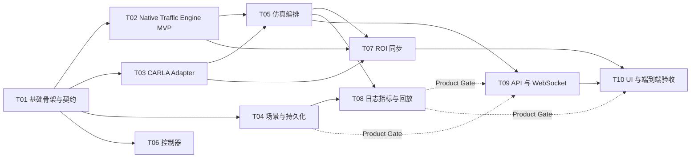

# TrafficVerse Agent Development Guide

> 版本：v1.1
> 状态：Baseline
> 架构基线：[SYSTEM_DESIGN.md](./SYSTEM_DESIGN.md)
> 决策约束：[ADR.md](./ADR.md)
> 工程规范：[AGENTS.md](../AGENTS.md)

## 1. 使用方式

本文将 TrafficVerse 拆分为 10 个可单独交给 Codex Agent 的开发任务。这里的“独立”是指：任务有独立的目录所有权、明确输入输出、可单独运行的测试和可审查的完成报告；它不表示所有任务都可忽略依赖同时开始。

每个 Agent 开始前必须依次阅读：

1. `docs/PRD.md`；
2. `docs/SYSTEM_DESIGN.md`；
3. `docs/ADR.md`；
4. `AGENTS.md`；
5. 本文的通用规则和自己的任务章节；
6. 依赖任务产出的公开契约与测试，不读取或耦合其内部实现。

若代码尚未初始化，从任务 T01 开始。后续 Agent 不得自行推翻 `Native Traffic Engine Truth Source`、ROI 滞回、固定步长、接口分层和存储分工；确需修改时，先新增或修订 ADR，说明迁移和兼容方案。

## 2. 全局开发规则

### 2.1 工作边界

- 只修改任务“输出/允许修改”列出的目录；需要跨边界修改时，在完成报告中提出变更请求，不直接侵入其他模块。
- 公共契约集中在 `src/trafficverse/domain` 和 `src/trafficverse/ports`，只有 T01 默认拥有修改权；其他任务如需变更，先提交契约提案及兼容性测试。
- 第三方 SDK 对象不得越过 adapter 边界。CARLA、SQLAlchemy、FastAPI 类型不得出现在 `domain`。
- 不使用全局可变状态。实验相关服务按 `experiment_id` 隔离。
- 不硬编码地图、车辆数、比例、ROI、步长、端口、超时和输出路径。
- 每个外部依赖都提供 fake 或 stub，使单元测试不需要 CARLA、PostgreSQL 或 GUI。Native Traffic Engine 和 Map Compiler 的单元测试必须完全离线。

### 2.2 代码与测试标准

- Python 代码遵循 PEP 8、完整类型标注和简洁 docstring；公共函数不得返回无约束 `dict[str, Any]`。
- 格式、lint、类型和测试的统一命令由 T01 固化在 `pyproject.toml` 和 `Makefile`/脚本中。
- 单元测试覆盖成功路径、边界条件和失败清理；不得只验证“没有抛异常”。
- 时间相关测试使用 fake clock；随机行为使用固定 seed；禁止依赖真实 sleep。
- WebSocket、JSON Schema 和 Port fake 使用契约测试，防止模块独立开发后无法集成。
- 测试 fixture 小而确定，不提交大型二进制地图、录像或运行产物。

### 2.3 每个任务的完成报告

Agent 完成任务时必须给出：

```text
Task: Txx
Status: COMPLETE | BLOCKED
Changed files: ...
Public interfaces added/changed: ...
Commands run and results: ...
Acceptance criteria: AC-1 PASS, AC-2 PASS, ...
Known limitations: ...
Contract/ADR changes requested: ...
```

`COMPLETE` 只表示所有验收标准已实际通过。外部环境缺失时，可用 fake 完成单元和契约验收，但依赖真实组件的验收必须明确标为未运行，不能宣称通过。

## 3. 任务依赖与并行计划



建议执行批次：

| 批次 | 可并行任务 | 合并门槛 |
|---|---|---|
| Wave 1 | T01 | 公共 schema、ports、版本基线和 Town04 manifest schema 冻结 |
| Wave 2 | T02、T03 | 原生二维 traffic smoke 与 CARLA smoke 分别通过 |
| Wave 3 | T05、T07 | 唯一 tick、ROI、坐标和信号灯共仿真通过 |
| Wave 4 | T09、T10 的实时子集 | 全局 2D + 局部 3D Core Run Gate 通过 |
| Wave 5 | T04、T06、T08 | 场景持久化、多级控制器、指标与回放分别通过 |
| Wave 6 | T09、T10 完整集 | Product Gate、性能基线和交付检查通过 |

### 3.1 Core Run 与 Product Gate

首轮 Agent 只追求 `SYSTEM_DESIGN.md` 第 13.1 节 Core Run Gate，执行顺序为：

```text
T01 → (T02 || T03) → T05 → T07 → T09-live → T10-live
```

其中：

- T01 必须先固定运行版本、地图 manifest schema 和机器可读契约；
- T05 在 Native Traffic Engine 内置基础行为模式下即可运行，不依赖 T06；
- T09-live 只实现 health、地图读取、实验控制、车辆/相机实时消息；
- T10-live 只实现运行页所需的全局 2D、局部 3D 和控制栏；
- T04、T06、T08 以及 T09/T10 的场景管理、Dashboard、Replay 部分进入 Product Gate。

首轮明确暂缓：精细 L2–L4、3D 回放、多 ROI、行人、传感器套件、WebRTC/二进制视频、React、多实验并发、5,000–10,000 车辆优化。Agent 不得为了这些能力延迟 Core Run。

### 3.2 实施状态

| 任务 | 状态 | 验收证据 | 下一步 |
|---|---|---|---|
| T01 | COMPLETE（2026-07-15） | Python 3.10.18；Ruff、Mypy 通过；32 个单元/契约测试通过；macOS readiness 通过；Mac 强选 `core-run` 被阻断 | 公共契约已冻结 |
| T02 | COMPLETED（2026-07-15） | `traffic-network/1.0`、Town04 Map Compiler、Native Traffic Engine、50 车 2 分钟 smoke、macOS arm64 doctor/map/traffic CLI 及 AC1–AC8 自动化验收均通过 | 可启动 T03；T05/T07 继续等待各自其余依赖 |
| T03 | IMPLEMENTED / LIVE VALIDATION PENDING（2026-07-16） | 远程 CARLA Adapter、mock/contract、doctor/smoke CLI、AC1–AC4/AC6 离线门槛通过；AC5/AC7/AC8 须在目标 Ubuntu CARLA 0.9.16 主机执行 | 配置远程端点并运行 `trafficverse carla smoke`；通过后改为 COMPLETED |
| T04 | COMPLETE（2026-07-16） | Scenario CRUD/clone/分页/软删除、不可变版本与乐观锁、实验事务/history、事件/指标/artifact、Alembic upgrade/downgrade、schema 自动检查和 PostgreSQL 16 repository contract 均通过 | T08 与完整 T09 的持久化依赖已满足 |
| T05 | COMPLETE（2026-07-16） | 唯一 50 ms 时钟、串行生命周期、controller→traffic→ROI/signal→CARLA→camera→publish 顺序、可选 CARLA 降级、故障逆序清理、registry 单运行限制及真实 Native Traffic Engine + Fake CARLA 200 tick 均通过 | T07、T08、T09-live 的编排依赖已满足 |
| T07 | IMPLEMENTED / LIVE VALIDATION PENDING（2026-07-16） | AC1–AC5 通过；Town04 三控制点配准、ROI 滞回/双向唯一映射/退避重试/Actor 上限、198 个 OpenDRIVE 信号严格 readiness、真实 Native Traffic Engine + Fake CARLA 500 tick/10 Actor 离线闭环通过；10,000×100 与 1,000×10,000 Product Gate 通过 | 在远程 CARLA 0.9.16 执行 AC6–AC8 Core Run，确认真实 Actor 数、逐 tick 信号一致与坐标误差后改为 COMPLETED |
| T09-live | CORE RUN COMPLETE（2026-07-16） | FastAPI health/readiness、地图读取与异步 OpenDRIVE 导入、实验串行控制、车辆控制、版本化 WebSocket、完整快照恢复、健康/车辆/信号灯/相机消息、有界慢客户端策略及 OpenAPI/WebSocket 契约均通过；114 个默认测试、Ruff、Mypy 与 macOS arm64 doctor 通过 | 启动 T10-live；Scenario CRUD、Dashboard、Replay API 留待 Product Gate |
| T10-live | IMPLEMENTED / REMOTE CARLA VALIDATION PENDING（2026-07-16） | PySide6 运行页、Leaflet 全局二维、198 个空间信号点、JPEG latest-only 解码、地图导入/选择、生命周期与单车控制、断线恢复、二维 Core API Runtime 和启动命令已实现；57 个聚焦测试、2 个 E2E、macOS arm64 loopback serve smoke 通过 | 在远程 CARLA 0.9.16 Runtime 验证实际相机、至少 10 个 ROI Actor、坐标/信号一致和清理后，将 T03/T07/T10-live 改为 COMPLETE |
| T06、T08 | NOT STARTED | 尚无对应真实组件验收证据 | Core Run 远程验收后进入 Product Gate，再完成 T06、T08 和 T09/T10 完整集 |

T01 公共契约已由 T02 迁移为 `TrafficEnginePort/TrafficSnapshot`，Town04 原生资产与二维交通引擎已完成。T03 CARLA 代码已完成离线验收，但真实远程 CARLA 证据尚未取得；T04 PostgreSQL 持久化和 T05 Simulation Manager 已完成验收；T07 ROI/配准/信号同步已完成离线实现，等待远程 CARLA Core Run；T09-live 实时 API和 T10-live UI 已完成本地实现。下一项 Core Run 工作是在目标 Linux/CARLA 环境执行 T03/T07/T10 联合真实验收。

## 4. T01 — 项目骨架、配置与公共契约

### 目标

建立所有后续任务共同依赖的项目结构、工具链、领域模型、配置 schema、Port 接口和测试替身。此任务不实现 Native Traffic Engine、CARLA、数据库或 UI 的真实逻辑。

### 输入

- `docs/PRD.md`；
- `docs/SYSTEM_DESIGN.md` 第 2、3、8、9、10、12 节；
- `docs/ADR.md` 中 ADR-004、ADR-005、ADR-007、ADR-008、ADR-015、ADR-016、ADR-018、ADR-020、ADR-021、ADR-022。

### 输出 / 允许修改

- `pyproject.toml`、`README.md`、`.env.example`；
- `src/trafficverse/domain/**`；
- `src/trafficverse/ports/**`；
- `src/trafficverse/config/**`；
- `src/trafficverse/bootstrap.py`（仅依赖装配骨架）；
- `configs/runtime-baseline.yaml`、`configs/defaults.yaml` 和 `configs/scenarios/core-run-town04.yaml`；
- `contracts/scenario.schema.json` 和公共消息 JSON Schema；
- `tests/unit/domain/**`、`tests/contract/**`、`tests/fixtures/**`；
- 统一开发命令（例如 Makefile 或 `scripts/check.sh`）。

### 实现要求

1. 定义 `VehicleState`、`TrafficLightState`、`SignalBinding`、`CameraFrame`、`ControlCommand`、`SimulationFrame`、`MetricSample`、`DomainEvent` 和 WebSocket envelope。
2. 定义 `ScenarioConfig`、`RuntimeBaseline`、`MapManifest` 及其嵌套配置，支持 YAML 加载、环境变量覆盖部署字段、解析后快照和 SHA-256 hash。
3. 定义 `TrafficEnginePort`、`CarlaPort`、`ExperimentRepository`、`ArtifactWriter`、`EventPublisher`、`DataLoggerPort`。
4. 定义领域错误码、实验状态枚举和状态迁移规则。
5. 提供可复用的 Fake TrafficEngine/Carla/Repository/Publisher。
6. 固化 Python 3.10、CARLA 0.9.16、`traffic-network/1.0`、PostgreSQL 16 运行基线；配置 format、lint、typecheck、pytest。
7. 实现独立版本握手服务；无真实 CARLA 时用 Fake 返回版本，Native Traffic Engine 在后续任务接入。

### 验收标准

- **T01-AC1**：从示例 YAML 可解析出类型化配置，非法自动驾驶比例、负 ROI、非法步长和缺失配准文件会得到定位到字段的错误。
- **T01-AC2**：`VehicleState` 和 WebSocket envelope 可生成稳定 JSON Schema，JSON round-trip 不丢字段。
- **T01-AC3**：状态机拒绝 `CREATED → RUNNING` 等非法跃迁，合法生命周期测试完整覆盖。
- **T01-AC4**：Fake ports 可驱动一个无外部依赖的最小 tick fixture。
- **T01-AC5**：格式、lint、类型检查、单元与契约测试命令全部通过。
- **T01-AC6**：`domain` 和 `ports` 中不存在 CARLA、FastAPI、SQLAlchemy、PySide6 导入。
- **T01-AC7**：版本不一致、manifest checksum 错误或 `validated: false` 时 readiness 明确失败。

### 依赖

无。T01 是其他所有任务的前置依赖。

## 5. T02 — Native Traffic Engine MVP 与 Map Compiler

### 目标

移除运行时 SUMO 依赖，冻结原生路网 schema，实现 Town04 OpenDRIVE 导入、二维 GeoJSON、固定信号灯、基础交通行为、车辆批量控制和确定性固定步进，使 Native Traffic Engine 成为唯一运动学真值源。

### 输入

- T01 的公共模型和 Fake；
- CARLA 0.9.16 `Town04.xodr`；
- PRD 第 3、5、7 节定义的 MVP 边界；
- `SYSTEM_DESIGN.md` 第 4.2、6.1、6.3 节；
- ADR-004、ADR-008、ADR-016、ADR-022。

### 输出 / 允许修改

- `src/trafficverse/maps/**`；
- `src/trafficverse/traffic/**`；
- 对 `src/trafficverse/domain/**`、`ports/**`、`config/**`、`bootstrap.py`、CLI 的契约迁移；
- `configs/maps/town04/{manifest.yaml,Town04.xodr,network.json,routes.yaml,registration.yaml,signals.yaml,network.geojson}`；
- `tests/unit/maps/**`、`tests/unit/traffic/**`、`tests/integration/traffic/**`；
- `scripts/maps/**`、`pyproject.toml`、`uv.lock`、runtime baseline、README；
- 删除或隔离不再使用的 SUMO adapter、配置、测试和依赖；删除前保留必要的测试语义，不保留运行时兼容层。

### 实现要求

1. 将公共 `SumoPort/SumoConfig/SumoSnapshot/SimulationFrame.sumo` 主版本迁移为 `TrafficEnginePort/TrafficEngineConfig/TrafficSnapshot/SimulationFrame.traffic`，更新 schema、fake 和契约测试。
2. 定义 `traffic-network/1.0` JSON schema，Map Compiler 离线解析 Town04 OpenDRIVE，生成稳定 lane/link/signal ID、`network.json` 和 `network.geojson`。
3. 校验所有 lane/link 引用、路线可达性、信号控制 link、停止线和 manifest checksum；不支持且影响语义的元素必须失败。
4. 实现车辆生成/到达、固定路线、最短路预计算、每车道排序索引和位置/heading 插值。
5. 实现自由行驶、基础跟驰、安全制动、红黄灯停止、固定周期信号和命令触发的相邻安全换道。
6. 实现两阶段批量步进：全部车辆读取 T-1 快照，计算 proposed state，通过全局安全检查后按稳定顺序原子提交 T 快照。
7. step 前批量应用速度/加速度/停车/换道意图；不存在车辆或非法换道产生结构化拒绝，不中断其他车辆。
8. 相同输入和 seed 生成字节稳定资产与快照序列；采集车辆数、信号数、step duration 和拒绝命令数。
9. 从 Python/runtime baseline/doctor/CLI/README 移除 SUMO、TraCI、sumolib 和 `.sumocfg` 依赖；`trafficverse doctor` 在 macOS 可验证原生二维运行就绪。

### 验收标准

- **T02-AC1**：Town04 `.xodr` 可离线编译为 schema 合法的 `network.json` 和可由 Leaflet 读取的 `network.geojson`；相同输入两次产物 hash 一致。
- **T02-AC2**：无悬空 lane/link/signal 引用；50 车验收路线全部可达；损坏拓扑、未知关键元素或 checksum 错误会拒绝 READY。
- **T02-AC3**：自由行驶、前车停车、红灯排队、绿灯启动、生成延迟、到达退出和安全换道均有确定性单元测试，测试中无追尾和负速度。
- **T02-AC4**：控制命令在目标 step 前应用；非法命令被单车拒绝且其他车辆继续推进；调用和提交顺序有测试锁定。
- **T02-AC5**：Town04 固定 50 车以 50 ms 运行 2 分钟，至少一车经过信号路口、至少一车完成受控换道，tick p95 < 50 ms。
- **T02-AC6**：相同 seed 两次完整运行的每帧 hash 一致；打乱内部车辆迭代顺序不改变结果。
- **T02-AC7**：公共契约、OpenAPI/WebSocket schema fixture 和 Fake Port 全部迁移为 traffic 中性命名，仓库活动代码不再导入 TraCI/sumolib。
- **T02-AC8**：`uv run trafficverse doctor` 在 macOS arm64 无外部交通仿真器时报告二维引擎 READY；CLI 可完成 map compile、map validate 和 traffic smoke。

### 依赖

T01。可与 T03、T04、T06 并行。

## 6. T03 — CARLA Manager 与三维 Adapter

### 目标

实现远程 Linux Simulation Runtime 内的 CARLA 连接、世界加载、同步模式、天气、车辆 Actor 批量生命周期、信号灯写入、坐标变换应用和 RGB 相机帧输出；macOS 仅执行 mock/contract 测试和远程控制。

### 输入

- T01 的 `CarlaPort`、渲染模型和 Fake；
- CARLA 0.9.16 Town04、地图 manifest、配准和 signals 配置；
- `SYSTEM_DESIGN.md` 第 3.3、4.3、6.3 节；
- ADR-003、ADR-004、ADR-013、ADR-018、ADR-020、ADR-022。

### 输出 / 允许修改

- `src/trafficverse/adapters/carla/**`；
- `tests/unit/adapters/carla/**`；
- `tests/integration/carla/**`；
- CARLA 连接检查与 smoke 脚本；
- 需要的 CARLA 配置示例。

### 实现要求

1. 连接配置指定的 CARLA server，加载 Town、天气、同步模式和 fixed delta。
   远程 RPC 必须设置有限 timeout，client 运行在受支持的 Linux/Windows 环境，不要求 macOS 安装 CARLA SDK。
2. 车辆 blueprint 选择可配置且有确定性 fallback；批量 spawn/update/destroy。
3. 镜像车辆禁用 autopilot，transform 由 TrafficVerse 写入。
4. spawn 失败可重试且有上限；destroy 对已不存在 Actor 幂等。
5. Core Run 支持 BIRD_VIEW 和 FOLLOW；FREE、TOP、ROAD_SIDE、DRONE 留在 Product Gate。
6. 恢复世界原始 settings，避免测试结束污染 CARLA server。
7. 实现 `update_traffic_lights`，禁用 CARLA 自主信号周期，只接受 TrafficVerse 批量写入。
8. 实现 `sensor.camera.rgb`，默认 960×540、10 FPS、JPEG quality 75；回调写入容量 2 的队列并输出带 `carla_frame` 的 `CameraFrame`。
9. 验证 client/server 均为 0.9.16；Simulation Manager 是唯一允许调用 `world.tick()` 的 client。

### 验收标准

- **T03-AC1**：mock CARLA 下验证连接、加载、批量 Actor 操作和关闭的调用顺序。
- **T03-AC2**：固定步长与场景配置一致，异步模式或 delta 不匹配时拒绝进入 READY。
- **T03-AC3**：spawn 部分失败只影响对应车辆，返回逐项结果并可在后续 tick 重试。
- **T03-AC4**：相机跟随不存在车辆时返回稳定错误，不崩溃或保留悬空引用。
- **T03-AC5**：真实 CARLA smoke 测试可创建、移动、销毁至少 10 个 Actor，结束后 Actor 数恢复基线。
- **T03-AC6**：公共 Port 契约测试通过，CARLA 类型不泄漏出 adapter。
- **T03-AC7**：真实 Town04 中可按 binding 批量设置 RED/YELLOW/GREEN，CARLA 自主周期不会覆盖写入状态。
- **T03-AC8**：连续取得至少 100 个 JPEG 相机帧；帧号单调、队列有界，慢消费者不会阻塞 CARLA tick。

真实 AC5/AC7/AC8 在远程 Ubuntu CARLA 0.9.16 Runtime 执行；macOS 合并门槛为全部 mock、契约、静态检查通过，并提供同一 smoke 命令。

### 依赖

T01。可与 T02、T04、T06 并行。

## 7. T04 — Scenario Manager、PostgreSQL 与迁移

### 目标

实现场景 CRUD/版本化、实验元数据与状态持久化、事件/指标索引和数据库迁移。

本任务属于 Product Gate。Core Run 可直接加载受控 YAML，不等待 PostgreSQL 场景管理。

### 输入

- T01 配置与 repository ports；
- `SYSTEM_DESIGN.md` 第 4.1、7、8.1 节；
- ADR-007、ADR-010、ADR-015。

### 输出 / 允许修改

- `src/trafficverse/application/scenario_service.py`；
- `src/trafficverse/adapters/persistence/postgres/**`；
- `migrations/**`；
- `tests/unit/application/test_scenario_service.py`；
- `tests/integration/persistence/**`。

### 实现要求

1. 场景创建、读取、分页、更新、复制、软删除；每次更新产生不可变 `scenario_version`。
2. 乐观锁防止覆盖并发修改；配置内容保存为 JSONB 并记录 hash。
3. 实验创建和状态迁移使用事务；状态历史只追加不改写。
4. 实现 event、metric_sample、artifact 元数据 repository。
5. 编写 Alembic 初始迁移、索引、约束和 downgrade。
6. repository 与业务服务分层，SQLAlchemy model 不进入 domain。

### 验收标准

- **T04-AC1**：Scenario CRUD、clone、soft delete 和分页测试通过；删除后默认列表不可见但历史实验仍可读取。
- **T04-AC2**：两个客户端更新同一版本时恰有一个成功，另一个得到冲突。
- **T04-AC3**：非法实验状态迁移整个事务回滚，不留下不一致 history。
- **T04-AC4**：空数据库可 upgrade 到 head，downgrade 后可再次 upgrade。
- **T04-AC5**：ER 图要求的唯一约束、外键和查询索引有自动化检查。
- **T04-AC6**：在测试 PostgreSQL 上 repository contract tests 全部通过。

### 依赖

T01。可与 T02、T03、T06 并行。

## 8. T05 — Simulation Manager 与实验生命周期

### 目标

实现单一固定步长编排器、实验命令队列、生命周期、组件健康和故障清理。先用 Fake ports 完成，不包含 ROI 算法细节、API 或 UI。

### 输入

- T01 公共状态机和 ports；
- T02 Native Traffic Engine；
- T03 CARLA adapter；
- T01 的 HUMAN/no-op Controller fake；T06 registry 仅在 Product Gate 接入；
- `SYSTEM_DESIGN.md` 第 4.10、6.2、6.3、11.2 节；
- ADR-004、ADR-014、ADR-015、ADR-021、ADR-022。

### 输出 / 允许修改

- `src/trafficverse/application/simulation_manager.py`；
- `src/trafficverse/application/experiment_registry.py`；
- `src/trafficverse/application/clock.py`；
- `tests/unit/application/test_simulation_manager.py`；
- `tests/integration/simulation/**`。

### 实现要求

1. `prepare/start/pause/resume/stop/set_speed/run_tick`；命令按实验串行执行且幂等。
2. tick 顺序严格为：controller(previous) → apply traffic controls → Native Traffic Engine step → 原子提交同帧 snapshot → ROI plan + signal plan → CARLA batch apply → CARLA tick → camera frame → publish hooks。
3. 采用仿真时间而非墙上时间驱动；1×/2×/0.5× 只改变调度节奏，不改变仿真 step。
4. 支持无 CARLA 降级配置；Native Traffic Engine 不可恢复状态错误默认导致实验失败。
5. 所有退出路径释放已启动组件，并持久化最终状态和失败原因。
6. 同一进程内通过 registry 隔离实验实例；MVP 可限制同时 RUNNING 数量为 1，但限制必须显式配置。
7. Simulation Manager 是唯一 Native Traffic Engine `step` 和 CARLA `world.tick` 调用者；相机 callback、UI 和健康检查都不得推进仿真。

### 验收标准

- **T05-AC1**：Fake clock/ports 下完整执行 CREATED→...→COMPLETED，调用顺序逐项断言。
- **T05-AC2**：pause 后仿真时间不推进；resume 从原时间继续；speed 变化不改变 step_ms。
- **T05-AC3**：重复 start/pause/stop 得到幂等结果或稳定冲突，不产生重复外部资源。
- **T05-AC4**：在每个初始化阶段和 tick 阶段注入异常，已打开组件均逆序清理，实验进入 FAILED。
- **T05-AC5**：控制器只读取上一帧，命令在下一次 Native Traffic Engine step 前应用。
- **T05-AC6**：真实 Native Traffic Engine、Fake CARLA 模式运行 200 tick 并正常停止。
- **T05-AC7**：调用序列断言包含 signal batch 和 camera frame；旧相机帧保留真实 frame/time，不伪装为当前 tick。

### 依赖

Core Run 依赖 T01、T02、T03；T06 仅为 Product Gate 依赖。为便于提前集成，可先基于 T01 fakes 开发，但最终验收必须接入真实 adapters。

## 9. T06 — 多级车辆控制器

### 目标

实现统一控制器接口、注册表、参数校验以及 Human/ACC/L2/L3/L4 的 MVP 确定性策略。

本任务属于 Product Gate。Core Run 使用 Native Traffic Engine 内置基础交通行为，不等待 L2–L4 实现。

### 输入

- T01 的 `VehicleState`、`VehicleObservation`、`ControlCommand`；
- 场景 automation 配置；
- `SYSTEM_DESIGN.md` 第 4.5 节；
- ADR-008、ADR-016、ADR-022。

### 输出 / 允许修改

- `src/trafficverse/controllers/**`；
- `tests/unit/controllers/**`；
- 控制器参数示例配置和行为说明。

### 实现要求

1. 统一 `initialize/step/reset` 接口与 `ControllerRegistry`，按 automation level 和场景参数实例化。
2. Human 使用 Native Traffic Engine 的基础行为或输出无覆盖意图；ACC 实现有界纵向跟驰；L2 增加规则换道；L3 增加风险触发接管；L4 提供全自动规则策略的可替换骨架。
3. 输出强制执行加速度、速度和换道边界；NaN/Inf 视为控制器错误。
4. 每辆车随机流由 experiment seed + vehicle_id 派生，顺序变化不影响结果。
5. 控制器仅输出意图，不调用外部 SDK，不维护跨实验全局状态。

### 验收标准

- **T06-AC1**：每个 automation level 均可由 registry 创建并通过统一 contract tests。
- **T06-AC2**：典型跟驰、自由行驶、停止车、换道受阻、接管风险场景有表驱动测试。
- **T06-AC3**：输出永远在配置边界内，非法输入得到明确错误或安全制动结果。
- **T06-AC4**：相同 seed 和观察序列得到字节级一致命令；不同车辆的随机流互不干扰。
- **T06-AC5**：controllers 包不导入 Native Traffic Engine 具体实现、CARLA、FastAPI、SQLAlchemy。
- **T06-AC6**：新增一个测试控制器无需修改 Simulation Manager，只需注册 factory。

### 依赖

T01。可与 T02、T03、T04 并行；是 T05 的依赖。

## 10. T07 — ROI、坐标配准与信号灯同步

### 目标

实现 ROI 核心区+缓冲区滞回、一一 Actor 映射、Town04 坐标转换、信号灯映射及 Native Traffic Engine→CARLA 的完整同步闭环。

### 输入

- T02 的 `TrafficSnapshot`；
- T03 的 `CarlaPort`；
- T05 的 tick hook；
- Town04 `manifest.yaml`、`registration.yaml`、`signals.yaml`；
- `SYSTEM_DESIGN.md` 第 3.3、4.4、6.4 节；
- ADR-003、ADR-013、ADR-022。

### 输出 / 允许修改

- `src/trafficverse/roi/**`；
- 对 T05 预留 ROI hook 的接线实现；
- `tests/unit/roi/**`；
- `tests/integration/roi/**`；
- 最小地图配准 fixture。

### 实现要求

1. `reconcile` 保持纯函数/纯逻辑，返回 spawn/update/destroy plan；副作用在 apply service 中执行。
2. 默认进入阈值 1000 m、退出阈值 1200 m，全部来自配置；支持固定焦点和跟随车辆焦点。
3. `vehicle_id ↔ actor_id` 一一对应；部分 spawn 失败不写入 ACTIVE 映射，并按退避策略重试。
4. `TrafficSnapshot` 中消失的车辆立即列入销毁；CARLA 中意外丢失的 Actor 删除旧映射并按仍在 ROI 与否决定重建。
5. 坐标转换集中在 `CoordinateTransformer`；使用至少 3 个控制点校验配准误差。
6. 达到 Actor 上限时优先保留关注车辆和更靠近焦点的车辆，并发出降级事件。
7. 实现 `SignalSynchronizer`：binding 持久化 CARLA OpenDRIVE signal ID，world 加载后解析运行时 Actor ID；每 tick 将原生信号状态映射为 CARLA RED/YELLOW/GREEN/OFF。
8. 提供 Town04 资产构建与 checksum 校验；不得在运行时自动修正未知 lane/signal 映射。

### 验收标准

- **T07-AC1**：车辆在 999→1001→1199→1201 m 移动时恰好 spawn 一次、destroy 一次，无边界抖动。
- **T07-AC2**：同一 tick 的 plan 中同一车辆不会同时 spawn 和 destroy，映射始终双向唯一。
- **T07-AC3**：TrafficSnapshot 车辆消失、CARLA Actor 意外消失、spawn 部分失败和重复 destroy 均有测试。
- **T07-AC4**：控制点配准误差在阈值内通过，超过阈值拒绝启动；角度和轴方向有 fixture 验证。
- **T07-AC5（Product Gate）**：Fake adapters 下分别验证 10,000 车辆连续 100 tick，以及 1,000 车辆连续 10,000 tick；映射内存有界且无孤儿 binding。
- **T07-AC6**：小型真实 Native Traffic Engine + CARLA smoke 中 Actor 数与 ROI 期望一致，结束后无残留 Actor。
- **T07-AC7**：基准车通过指定 Town04 信号路口时，Native Traffic Engine 与 CARLA 信号灯在同一仿真 tick 一致；缺失 binding 时 readiness 失败。
- **T07-AC8**：Core Run 固定场景完成 50 车全局、至少 10 Actor 局部同步，坐标误差不超过 0.5 m。

远程 CARLA 现场验收统一执行：

```bash
TRAFFICVERSE_CARLA_INTEGRATION=1 uv run pytest -q -m carla \
  tests/integration/roi/test_remote_carla_roi.py
```

运行环境必须提供 CARLA 0.9.16 Python client，并通过 `TRAFFICVERSE_CARLA_HOST`、`TRAFFICVERSE_CARLA_PORT` 指向目标 server。该测试覆盖 50 个全局 vehicle ID、至少 10 个 ROI Actor、受控信号路口通过、严格 signal readiness 和停止后零残留 Actor。

### 依赖

T01、T02、T03、T05。

## 11. T08 — Data Logger、Dashboard 指标与 Replay

### 目标

实现高频数据记录、Parquet 分区、结构化事件、Dashboard 权威指标和基于 snapshot+delta 的可跳转回放。

本任务属于 Product Gate，不阻塞实时原生 2D + CARLA 3D Core Run。

### 输入

- T04 persistence repositories；
- T05 `SimulationFrame` 与生命周期 hooks；
- 公共事件/指标模型；
- `SYSTEM_DESIGN.md` 第 4.7、4.8、4.9、7、11.3 节；
- ADR-010、ADR-012、ADR-014、ADR-016。

### 输出 / 允许修改

- `src/trafficverse/application/metrics_engine.py`；
- `src/trafficverse/application/replay_service.py`；
- `src/trafficverse/logging/**`；
- `src/trafficverse/adapters/persistence/parquet/**`；
- `tests/unit/metrics/**`、`tests/unit/replay/**`；
- `tests/integration/artifacts/**`。

### 实现要求

1. 定义并实现 PRD 指标：平均速度、旅行时间、通行量、排队、事故、自动驾驶比例、换道、急刹、接管；系统指标单独命名。
2. 高频轨迹按 `experiment/minute` 分区写 Parquet，批量写入并生成 schema、checksum 和 manifest。
3. logger 采用有界队列，与 tick 非阻塞解耦；过载时按架构规定降采样并产生 `DATA_DEGRADED`。
4. replay 周期性 snapshot + 有序 delta/event，支持 play/pause/step/speed/seek。
5. 实验结束时 flush、关闭 writer、写最终 manifest；异常退出尽可能生成标记为 incomplete 的 manifest。
6. 回放只读取记录，不调用 Native Traffic Engine、CARLA 控制器或 MetricsEngine 重新计算历史事实。
7. Core Run 阶段不要求三维回放；Product Gate 可先以结构化 2D 回放为验收，三维录像/重渲染另行评估。

### 验收标准

- **T08-AC1**：每个业务指标有公式、单位、窗口和 fixture 期望值测试；空集合不产生误导性的 0。
- **T08-AC2**：写入后 Parquet schema 稳定，轨迹键无重复，分区和 checksum 与 manifest 一致。
- **T08-AC3**：从 5 秒 snapshot 跳转到任意中间时间，重建 frame 与原始 frame hash 一致。
- **T08-AC4**：0.5×/1×/2× 和逐帧仅改变播放节奏/位置，不改变状态内容。
- **T08-AC5**：慢 writer 压测下 tick 不被文件 IO 长时间阻塞；发生降采样时事件和最终 manifest 可追踪。
- **T08-AC6**：正常与异常停止均关闭文件句柄，已完成文件可被标准 Parquet reader 读取。

### 依赖

T01、T04、T05。可与 T07 并行。

## 12. T09 — FastAPI REST 与 WebSocket Gateway

### 目标

实现版本化 REST 资源 API、WebSocket 命令/事件协议、订阅、流控、断线恢复和 OpenAPI 文档。

### 输入

- T04 Scenario/Experiment services；
- T05 Simulation Manager；
- T08 Metrics/Replay/Artifact services；
- T01 JSON schema 和 EventPublisher port；
- `SYSTEM_DESIGN.md` 第 8 节；
- ADR-006、ADR-008、ADR-014、ADR-016、ADR-020、ADR-021。

### 输出 / 允许修改

- `src/trafficverse/api/**`；
- `src/trafficverse/adapters/messaging/**`；
- `tests/unit/api/**`；
- `tests/contract/api/**`；
- `tests/integration/api/**`。

### 实现要求

1. 实现系统设计表中的 REST endpoint、统一错误结构、分页、乐观锁和 idempotency key。
2. 实现 `/api/v1/ws`、统一 envelope、命令 correlation、topic 订阅、心跳和重连 snapshot。
3. 每个 experiment 的控制命令写入串行队列；HTTP/WebSocket handler 不直接推进仿真。
4. 对车辆 delta 做按 vehicle_id 合并；状态变更、错误和事件不可静默丢失。
5. 生成并锁定 OpenAPI；为 WebSocket 消息生成 JSON Schema 目录。
6. 默认只监听 loopback；输入大小、频率、路径和枚举均有校验。
7. T09-live 必须先实现 `/health`、`/ready`、`/maps`、`/maps/import`、`/maps/import/{job_id}`、`/maps/{map_id}/network`、`/maps/{map_id}/manifest`、实验控制以及 `world.snapshot`、`vehicle.delta`、`traffic_light.delta`、`camera.frame`、`component.health`。
8. `camera.frame` 使用 JSON base64 JPEG，默认 960×540@10 FPS，单客户端、队列容量 1；只保留最新帧。
9. 实现 `vehicle.control` 命令并返回逐车 accepted/rejected 结果；handler 只入队，不直接修改引擎状态。

### 验收标准

- **T09-AC1**：所有 REST 成功/错误路径通过 API tests，状态码符合系统设计。
- **T09-AC2**：WebSocket 命令响应携带正确 correlation_id，非法状态命令得到 `command.rejected`。
- **T09-AC3**：模拟慢客户端时车辆 delta 被合并，事件和状态不丢；队列保持有界。
- **T09-AC4**：sequence 缺口/重连后客户端可请求并收到完整 `world.snapshot`。
- **T09-AC5**：OpenAPI 和 WebSocket schema 与 T01 模型一致，快照差异需要显式审查。
- **T09-AC6**：handler 层无 Traffic Engine 具体实现/CARLA/SQLAlchemy SDK 导入，单元测试无需外部仿真器。
- **T09-AC7**：可上传 Town04 `.xodr`、查询编译状态并由 Leaflet 加载发布后的 `network.geojson`；非法地图返回结构化校验报告；相机慢客户端不会拖慢车辆状态或实验命令。

### 依赖

Core Run 依赖 T01、T05；Product Gate 再依赖 T04、T08。

## 13. T10 — PySide6 UI、系统集成与交付验收

### 目标

分两阶段交付 UI：先完成运行页 Core Run，再扩展为 PRD 的四页面 Product Gate。

### 输入

- T07 ROI/CARLA 同步；
- T08 指标/回放；
- T09 REST/WebSocket；
- PRD 第 5、6、10 节；
- `SYSTEM_DESIGN.md` 第 2、6、11、12、13 节；
- ADR-011、ADR-017 及所有已接受 ADR。

### 输出 / 允许修改

- `ui/**`；
- `tests/e2e/**`、`tests/performance/**`；
- 启动/停止/环境检查脚本；
- `README.md` 的用户运行说明；
- 最终验收报告与已测硬件基线；
- 仅为接线和缺陷修复所需的跨模块小改动，必须记录来源和回归测试。

### 实现要求

1. Core Run：支持选择已验证地图或导入 `.xodr`，运行页包含 Leaflet `CRS.Simple` 路网、信号灯、全局车辆、CARLA JPEG 画面、组件状态、单车控制和开始/暂停/恢复/停止控制栏。
2. Product Gate：首页支持最近实验、创建、加载、复制、删除。
3. Product Gate：配置页支持地图、车辆数、自动驾驶比例、天气、时间、事件、ROI、step 及实时校验/预览。
4. Product Gate：补充 Dashboard、车辆/道路/事故详情和 Replay 时间轴；三维回放不作为首轮阻塞项。
5. UI 只调用 REST/WebSocket，不直接导入仿真或数据库模块；网络断开后显示降级并可重连。
6. 完成小型真实 E2E、无 CARLA 降级 E2E、故障注入、资源清理和性能基线。

### 验收标准

- **T10-AC1**：用户可导入/选择 Town04、看到校验结果，并从 UI 启动、暂停、恢复、停止 Core Run；状态一致且按钮按状态启用。
- **T10-AC2**：2D 显示全局车辆；3D 只显示 ROI Actor；车辆进入/离开 ROI 的视觉行为与映射一致。
- **T10-AC3（Product Gate）**：点击车辆/道路/事故展示 PRD 要求字段；Dashboard 指标来自后端而非 UI 重算。
- **T10-AC4**：Product Gate 完成实验可打开结构化 Replay，逐帧和 seek 后的时间、车辆状态、事件一致；三维回放延期。
- **T10-AC5**：Native Traffic Engine 故障、CARLA 降级和 WebSocket 重连均有可理解 UI 状态与 E2E 证据；logger 过载属于 Product Gate。
- **T10-AC6（Product Gate）**：小型场景连续运行 10 分钟无孤儿进程/Actor/文件句柄，内存无明显无界增长。
- **T10-AC7（Product Gate）**：在记录的基线硬件上报告 50/500/2,500 原生引擎车辆、配置 ROI Actor 规模下的 tick p50/p95、实时因子、UI 延迟、CPU/GPU/内存；2,500 未达到时明确列为后续限制，不阻塞 MVP。
- **T10-AC8**：新环境按 README 可完成依赖检查、启动和 Core Run smoke；数据库迁移属于 Product Gate。

### 依赖

Core Run 依赖 T01、T02、T03、T05、T07、T09-live。完整 Product Gate 依赖 T01–T09。UI 骨架可在 T09 schema 冻结后提前开发，但最终验收必须使用真实后端。

## 14. 集成门禁

每个任务合并前必须满足：

1. 自己的所有不依赖缺失外部环境的 AC 通过；
2. T01 契约测试无回归；
3. 公共 API/schema 变更有兼容说明；
4. 新配置有默认值、校验和示例；
5. 新失败路径有结构化错误与清理测试；
6. 不提交凭证、运行 artifact、数据库文件、大型二进制或本机绝对路径；
7. 文档与代码同一变更提交，完成报告可复现。

## 15. 给 Codex 的任务提示模板

将下面模板中的 `Txx` 替换为任务编号即可直接使用：

```text
请实现 docs/AGENT_DEVELOPMENT_GUIDE.md 中的 Txx。

开始前完整阅读：
- docs/PRD.md
- docs/SYSTEM_DESIGN.md
- docs/ADR.md
- AGENTS.md
- docs/AGENT_DEVELOPMENT_GUIDE.md 的全局规则和 Txx 章节

约束：
1. 只修改 Txx 允许的目录；公共契约变更先说明，不擅自破坏兼容性。
2. 先检查依赖任务输出和当前测试状态，保留用户已有修改。
3. 先补测试，再实现最小满足验收标准的代码。
4. 运行与风险相称的 format/lint/typecheck/test；不可运行的真实依赖测试要如实说明。
5. 不改变 Native Traffic Engine Truth Source、ROI 滞回、固定步长、Town04 同源资产、唯一 tick、原生信号灯主控和 JSON JPEG 相机方案。
6. 最后按本文 2.3 节格式提交完成报告，逐项列出 AC 的 PASS/FAIL 与证据。
```

## 16. 全系统 Definition of Done

只有同时满足以下条件，TrafficVerse v1.0 MVP 才算完成：

- T01–T10 均为 COMPLETE，且 Native Traffic Engine、CARLA/PostgreSQL 的关键验收已有实际运行证据；
- 从 UI 到 Native Traffic Engine/CARLA/存储/回放的主路径可重复执行；
- 真值权属、时间、坐标和 ID 在所有模块中一致；
- 异常停止不会遗留关键外部资源，数据降级可观察；
- 所有公共 schema 和 API 有版本，所有关键技术偏离都有 ADR；
- README 可以让未参与开发的人完成安装检查与 smoke run；
- 已记录性能数字和硬件环境，不以未测量假设代替验收结果。
