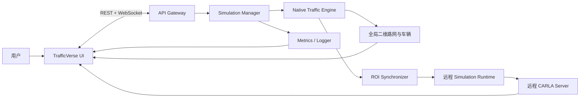

# TrafficVerse 产品需求文档（PRD）

> 版本：v1.2
> 状态：Baseline
> 日期：2026-07-16
> 目标：指导开发 Agent 完成“自研全局二维交通仿真 + CARLA 局部三维镜像”的可演示 MVP

## 1. 产品定义

TrafficVerse 是面向科研展示与教学演示的混合交通仿真平台。系统由 TrafficVerse 自研的
`Native Traffic Engine` 负责全路网二维交通状态，由 CARLA 负责关注区域（ROI）内的三维场景、
车辆模型、天气和相机画面。

系统不依赖外部交通流仿真器。自研引擎是车辆、路线、车道、交通信号灯和仿真时间的唯一真值源；
CARLA Actor 是对应车辆在 ROI 内的三维镜像，不独立决定全局交通状态。MVP 的 CARLA
Server 固定部署在远程 Ubuntu 22.04 x86_64 GPU 主机；使用官方 CARLA Python SDK 的
Simulation Runtime 与该 Server 部署在同一远程主机或同一低延迟私有网络。macOS 作为开发和
控制端，通过 TrafficVerse API/WebSocket 使用远程仿真能力，不要求安装或运行 CARLA SDK。

MVP 的目标不是复刻成熟交通仿真软件的全部能力，而是完成一条稳定、确定、可演示的主路径：

1. 导入一个 OpenDRIVE 地图并生成原生路网资产；
2. 在二维地图上显示道路、车道、路口、信号灯和全部车辆；
3. 按固定步长同时推进多辆车；
4. 支持基础跟驰、红灯停车、路线行驶和受控换道；
5. 支持通过统一命令控制车辆速度、加速度、换道和停车；
6. 将 ROI 内车辆与信号灯同步到 CARLA，展示局部三维画面；
7. 支持开始、暂停、恢复、停止及固定 seed 的确定性运行。

## 2. 用户与核心场景

### 2.1 目标用户

- 需要演示交通流和局部自动驾驶行为的研究人员；
- 需要验证车辆控制策略的算法开发者；
- 需要观察路网、车辆和信号协同行为的教学用户。

### 2.2 核心用户路径

1. 用户选择或导入一份 `.xodr` 地图；
2. 系统校验并编译为 TrafficVerse 原生路网；
3. 用户配置车辆数、路线/OD、信号方案、seed、步长和 ROI；
4. 用户启动实验；
5. 二维页面显示全路网车辆运动和交通信号灯；
6. ROI 内车辆映射到 CARLA，三维页面显示局部交通；
7. 用户可暂停、恢复、停止并对指定车辆下发控制命令；
8. 系统展示车辆数、平均速度、排队长度和运行状态。

## 3. 产品范围

### 3.1 MVP 必须实现

#### 地图导入与路网

- MVP 输入格式仅支持 OpenDRIVE 1.4 兼容 `.xodr`；首个验收地图固定为 CARLA 0.9.16 Town04；
- 解析道路、参考线、车道、车道宽度、速度限制、车道前后继、路口连接和交通信号；
- 将输入编译为版本化的 `network.json`，运行时不重复解析 OpenDRIVE；
- 生成 `network.geojson`，供二维地图直接显示；
- 生成并校验 `manifest.yaml`、`registration.yaml` 和 `signals.yaml`；
- 对不支持的 OpenDRIVE 元素明确报错，禁止静默忽略会改变连通性或信号语义的内容。

#### 原生交通仿真

- 使用 50 ms 固定仿真步长；
- 每辆车具有稳定 ID、路线、当前车道、纵向位置、速度、加速度和目标车道；
- 支持车辆按计划时间生成、沿路线行驶、到达后退出；
- 支持基础自由行驶、前车跟驰、安全制动、红灯停车和绿灯通行；
- 支持命令触发的左/右换道，换道前校验目标车道、前后安全间距和路线可达性；
- 支持固定周期交通信号灯，状态至少包含 RED、YELLOW、GREEN、OFF；
- 支持 Dijkstra 或 A* 最短路，MVP 可在启动时预计算固定路线；
- 所有车辆基于同一上一帧不可变快照计算下一帧，再一次性提交，避免车辆更新顺序影响结果；
- 相同地图、配置和 seed 必须产生相同车辆状态序列；
- 安全约束在控制器之后统一执行，非法或危险命令不得直接破坏车道拓扑或造成负速度。

#### 车辆并行控制

- `ControlCommand` 支持期望速度、期望加速度、左/右换道、停车和恢复；
- 控制器只读取当前快照并输出意图，不直接修改车辆对象；
- 引擎对一个 tick 内的全部车辆批量计算和批量提交；
- MVP 要求逻辑并行和顺序无关，不强制多线程；只有性能证据证明必要时才引入进程池或原生扩展；
- 单车控制失败不得阻断其他车辆，失败车辆执行安全降级并产生结构化事件。

#### 二维可视化

- 使用 Leaflet `CRS.Simple` 展示 `network.geojson`；
- 显示道路中心线、车道、路口、交通信号灯和全部车辆；
- 支持缩放、拖拽、点击车辆、按自动驾驶等级筛选；
- 车辆位置和信号状态通过版本化 WebSocket 增量更新；
- 页面不得自行推演车辆或信号状态。

#### CARLA 局部三维

- CARLA 0.9.16 Server 运行在远程 Linux GPU 主机，macOS 不直接承载 CARLA Server；
- CARLA Adapter 属于远程 Simulation Runtime，通过可配置 `host`、`port` 和网络超时连接 Server；
- 远程 Runtime 与 CARLA Server 必须位于同一主机或低延迟私有网络，公网逐 tick RPC 不作为 MVP 基线；
- macOS UI 只连接 TrafficVerse 的 REST/WebSocket 端点，CARLA RPC 端口不得直接暴露到公网；
- CARLA 只渲染 ROI 核心区及缓冲区内的车辆；
- 维护 `vehicle_id ↔ carla_actor_id` 一一映射；
- 每个 tick 在 CARLA `world.tick()` 前批量写入车辆 transform 和信号灯状态；
- CARLA 车辆关闭 autopilot，不向原生交通引擎反写运动学真值；
- CARLA 不可用时允许以二维模式运行并明确显示三维降级。
- 连接超时、版本不一致、远程断线和相机帧超时必须产生可观察健康状态，不得阻塞二维真值推进。

#### 生命周期与展示

- 支持 prepare、start、pause、resume、stop；
- 支持固定 0.5×、1×、2×播放倍率，但倍率不得改变仿真步长；
- 展示车辆数、平均速度、排队车辆数、仿真时间、tick 耗时和组件健康状态；
- 支持结构化日志和最小轨迹记录。

### 3.2 MVP 明确不实现

- OSM、Shapefile、Vissim 等多格式地图导入；
- 动态交通分配、用户均衡、动态改道和复杂 OD 标定；
- 高保真驾驶人心理模型、随机违规、行人、自行车和公共交通；
- 连续横向动力学、跨多车道换道和复杂无保护路口博弈；
- 路侧检测器、排放、噪声、充电和多模式交通；
- 多机分布式仿真、5,000–10,000 车辆优化；
- 完整 L2–L4、强化学习、三维回放、WebRTC 和生产级多租户。

## 4. 总体架构



### 4.1 真值权属

- Native Traffic Engine：车辆存在性、路线、车道、位置、速度、加速度、动作和交通信号灯；
- Simulation Manager：唯一仿真时钟、生命周期和 tick 顺序；
- CARLA：三维 Actor、相机帧、天气和三维组件健康；
- UI：只显示状态和提交命令，不计算权威交通状态。

### 4.2 固定 tick 顺序

```text
读取上一帧
→ 批量运行车辆控制器
→ 交通规则和安全约束
→ Native Traffic Engine 批量计算下一帧
→ 原子提交 TrafficSnapshot
→ 生成 ROI 与信号同步计划
→ 批量更新 CARLA
→ CARLA world.tick
→ 发布二维状态、相机和指标
```

## 5. 核心模块

### 5.1 Map Importer

输入：`.xodr` 文件和地图导入配置。

输出：

- `network.json`：道路、车道、连接、路口冲突区和信号 link；
- `network.geojson`：二维展示几何；
- `signals.yaml`：原生信号与 CARLA OpenDRIVE signal ID 映射；
- `registration.yaml`：原生地图坐标到 CARLA 坐标的配准；
- `manifest.yaml`：schema、来源、版本、checksum 和校验结果。

验收：Town04 可成功导入；无悬空 lane link；路线测试可达；信号引用有效；GeoJSON 可加载。

### 5.2 Road Network Model

维护：

- `Road`、`Lane`、`LaneLink`、`Junction`、`ConflictZone`；
- 车道中心线、长度、宽度、限速和允许方向；
- 前后继、相邻车道和路口连接；
- 对车辆状态只暴露不可变查询视图。

### 5.3 Demand and Routing

- 支持配置固定车辆、发车时间、起点、终点和车辆类型；
- 支持加载显式路线或通过最短路生成路线；
- 发车位置安全间距不足时延迟生成，不允许重叠插入；
- 到达路线终点后移除车辆并产生到达事件。

### 5.4 Traffic Behavior Engine

- 自由行驶：向道路限速和车辆期望速度平滑加速；
- 跟驰：根据前车距离、相对速度和最小时间间隔计算安全速度；
- 信号控制：根据停止线和信号状态生成停车约束；
- 换道：MVP 只支持相邻车道的命令换道和路线必需换道；
- 路口：信号控制路口按 link 放行；无信号复杂博弈不属于 MVP；
- 安全层：裁剪速度/加速度、阻止非法车道跳转并检测潜在碰撞。

### 5.5 Native Traffic Engine

职责：装载路网和需求、维护车辆索引、执行批量控制、推进信号灯、生成不可变快照。

公开能力：

```python
class TrafficEnginePort(Protocol):
    def load(self, config: TrafficEngineConfig) -> None: ...
    def apply_controls(self, commands: Mapping[str, ControlCommand]) -> None: ...
    def step(self, target_time_ms: int) -> TrafficSnapshot: ...
    def health(self) -> ComponentHealth: ...
    def close(self) -> None: ...
```

### 5.6 ROI and CARLA Synchronizer

- 车辆进入核心 ROI 时创建 CARLA Actor；
- 车辆离开扩展 ROI 时销毁 Actor；
- 缓冲区内保持已有映射，避免边界抖动；
- 信号灯由 Native Traffic Engine 主控并同步到 CARLA；
- CARLA Actor 生成失败不改变二维交通真值。

### 5.7 Visualization and API

- REST 提供地图、manifest、场景和实验生命周期；
- WebSocket 提供 `world.snapshot`、`vehicle.delta`、`traffic_light.delta`、`camera.frame` 和健康事件；
- 二维地图只消费 `network.geojson` 和标准快照；
- CARLA 图像使用 RGB JPEG 帧。

## 6. MVP 场景配置

```yaml
schema_version: "1.1"
scenario:
  name: core-run-town04-native
  map_id: town04-carla-0.9.16-native-v1
  seed: 42
simulation:
  step_ms: 50
  duration_ms: 120000
  speed_multiplier: 1.0
traffic:
  network: configs/maps/town04/network.json
  routes: configs/maps/town04/routes.yaml
  vehicles: 50
  behavior_profile: mvp-default
signals:
  programs: configs/maps/town04/signals.yaml
roi:
  radius_m: 1000.0
  buffer_m: 200.0
carla:
  mode: required
  endpoint_mode: remote_server
  host: ${TRAFFICVERSE_CARLA_HOST}
  port: 2000
  timeout_s: 30.0
  step_ms: 50
  expected_version: "0.9.16"
```

## 7. MVP 验收标准

### 7.1 地图导入

- Town04 `.xodr` 可离线编译为 `network.json` 和 `network.geojson`；
- 所有可行驶车道具有稳定 ID、有效几何、长度、限速和连接关系；
- 验收路线连通，信号灯和停止线引用有效；
- 相同输入生成相同 checksum。

### 7.2 交通仿真

- 固定 50 辆车、50 ms 步长连续运行 2 分钟；
- 车辆沿合法路线行驶，不出现负速度、非法 lane ID 或无解释的位置跳变；
- 前车停车和红灯场景不发生追尾；
- 绿灯后排队车辆能够依次启动；
- 至少一辆车完成受控换道；
- 同 seed 两次运行的快照 hash 完全一致；
- 50 辆场景 tick p95 小于 50 ms。

### 7.3 二维与三维演示

- Leaflet 显示路网、全部车辆和交通信号灯；
- UI 能开始、暂停、恢复和停止；
- 至少 10 辆车进入 ROI 并在 CARLA 中创建、更新和销毁；
- CARLA 和二维快照的车辆平面坐标误差不超过 0.5 m；
- CARLA 信号灯与 Native Traffic Engine 在同一 tick 一致；
- CARLA 不可用时二维演示仍能运行。
- macOS 控制端可通过远程 TrafficVerse API 启动实验并接收相机帧，不需要本地 CARLA SDK；
- 远程 Runtime 与 CARLA 之间版本握手为 0.9.16，RPC 连接中断时三维健康状态在超时窗口内降级；
- 远程 CARLA 端口仅在受控网络开放，配置和日志不得包含 SSH/VPN/API 凭证。

## 8. 后续产品能力

MVP 通过后再评估：

- 2,500 辆性能目标；
- 更完整的换道、无信号路口和驾驶人差异模型；
- 动态路由和交通需求生成；
- L2–L4、风险和接管策略；
- 指标、回放、视频和高级 Dashboard；
- 多地图格式、地图编辑器和自动校准。

在完成基准测试前，不得宣称 Native Traffic Engine 达到成熟交通仿真器的精度、容量或模型覆盖度。
