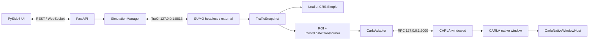

# TrafficVerse System Design

> 版本：v1.4
> 状态：Target Baseline（SUMO/CARLA 迁移中）
> 产品基线：[PRD](./PRD.md)
> 决策基线：[ADR-024、ADR-025](./ADR.md)

## 1. 系统边界与不可变原则

TrafficVerse 使用 SUMO 产生全局二维交通真值，使用自有 PySide6/Leaflet 页面显示二维状态，
使用 CARLA 显示 ROI 内三维镜像。SUMO 与 CARLA 的原生窗口采取不同策略：

- SUMO 只通过 TraCI 接入，不包装、不嵌入、不自动化 SUMO GUI；
- TrafficVerse 左侧二维地图只消费标准化 SUMO 快照并自行绘制；
- CARLA 必须 windowed 运行，其原生窗口由 Qt foreign-window 容器直接托管；
- 产品链路不创建 UI 专用 RGB sensor，不发布 `camera.frame`，不编码或解码 JPEG/base64；
- `SimulationManager` 是唯一 `traci.simulationStep()` 和 `CARLA world.tick()` 调用者；
- SUMO 是车辆、路线、车道、运动与交通信号灯的唯一真值源，CARLA 不反写交通状态；
- 固定步长为 50 ms，播放倍率只改变墙上时间调度；
- ROI 使用核心区加 Buffer 的滞回策略。

改变真值权属、唯一 tick、固定步长、窗口呈现或信号主控必须先新增 ADR。

## 2. 总体架构



依赖方向保持：

```text
ui -> REST/WebSocket contracts
api -> application -> ports -> domain
adapters/sumo -> ports + domain
adapters/carla -> ports + domain
roi -> domain + ports
bootstrap/cli -> application + concrete adapters
```

TraCI 和 CARLA SDK 对象不得越过 adapter 边界。UI 不导入后端包，也不直接连接 TraCI 或
CARLA RPC；CARLA 原生窗口嵌入只提供视觉容器，不提供业务控制旁路。

## 3. 固定运行基线

| 组件 | 版本/端点 | 约束 |
|---|---|---|
| Python | 3.10 | 项目运行时 |
| SUMO | 1.27.1 / `127.0.0.1:8813` | 外部 TraCI server，唯一 client |
| CARLA | 0.9.16 / `127.0.0.1:2000` | 本机、windowed、同步模式 |
| API | `127.0.0.1:8000` | loopback 默认 |
| UI | PySide6 6.11.1 | 与 CARLA 同图形桌面会话 |
| 地图 | CARLA 0.9.16 Town04 | SUMO 资产由同一 XODR 生成 |
| 步长 | 50 ms | SUMO/CARLA/manager 一致 |

推荐启动 SUMO 后端：

```bash
sumo -c configs/maps/town04/map.sumocfg --remote-port 8813
```

需要独立调试时可换成 `sumo-gui`；TrafficVerse 不依赖、嵌入或控制该 GUI。CARLA 必须使用
可见窗口模式，不得使用 `-RenderOffScreen` 或 no-rendering mode。

## 4. 配置与资产

目标场景配置版本为 `1.2`：

```yaml
schema_version: "1.2"
simulation:
  step_ms: 50
sumo:
  provider: sumo
  launch_mode: external
  host: 127.0.0.1
  port: 8813
  step_ms: 50
  tls_manager: sumo
  config_file: configs/maps/town04/map.sumocfg
  expected_version: "1.27.1"
carla:
  mode: required
  endpoint_mode: local_server
  host: 127.0.0.1
  port: 2000
  step_ms: 50
  expected_version: "0.9.16"
ui:
  api_url: http://127.0.0.1:8000
  carla_view:
    mode: native_window
    native_window_id_env: TRAFFICVERSE_CARLA_WINDOW_ID
```

场景加载必须拒绝未知字段，并校验三个 step 一致、`tls_manager=sumo`、端口范围、版本、manifest、
文件存在性和 checksum。部署字段可由以下环境变量覆盖，并写入 resolved snapshot：

- `TRAFFICVERSE_SUMO_HOST`、`TRAFFICVERSE_SUMO_PORT`；
- `TRAFFICVERSE_CARLA_HOST`、`TRAFFICVERSE_CARLA_PORT`、`TRAFFICVERSE_CARLA_TIMEOUT_S`；
- `TRAFFICVERSE_CARLA_WINDOW_ID`。

Town04 manifest 必须追踪：

- `Town04.xodr`；
- `Town04.net.xml`、`map.sumocfg`、`Town04.rou.xml`、`vtypes.rou.xml`；
- `network.geojson`、`network.json`；
- `registration.yaml`、`signals.yaml`、`routes.yaml`；
- CARLA/SUMO 版本、生成命令和 SHA-256。

`network.json` 和 GeoJSON 只服务查找、严格信号绑定及二维展示，不参与车辆推进。

## 5. 领域模型

公共时间使用整数 `simulation_time_ms`，每帧包含单调 `sequence`。`VehicleState` 使用稳定
SUMO vehicle ID，并统一为米、秒、弧度：

```text
TrafficSnapshot
  experiment_id
  simulation_time_ms
  sequence
  vehicles: tuple[VehicleState, ...]
  traffic_lights: tuple[TrafficLightState, ...]
```

SUMO 车辆 angle 转换为数学 heading 后，再由 `CoordinateTransformer` 应用 Town04 的 y 轴翻转，
得到 CARLA yaw。CARLA actor ID 只用于当前 world 生命周期内的 binding，不作为持久化车辆 ID。

## 6. SUMO Adapter

`SumoTrafficEngineAdapter` 是生产 `TrafficEnginePort` 实现，职责为：

1. 连接外部 TraCI server 并严格校验 SUMO 版本；
2. 在 step 前逐车应用速度、加速度、停车和相对换道意图；
3. 每次 `step(target_time_ms)` 恰好调用一次 `simulationStep`；
4. 校验 SUMO 返回时间与 target 完全一致；
5. 采集 vehicle、departed、arrived 和 traffic-light 状态；
6. 将 `linkSignalID:<index>` 映射为 OpenDRIVE signal ID；
7. 将 SDK 异常转换为稳定 `SUMO_*` 错误；
8. 幂等关闭 TraCI connection。

Adapter 没有自循环、线程或 wall-clock pacing。单车控制失败会记录 vehicle ID，并继续尝试同批其他
命令；连接或 step 失败属于真值丢失，实验进入 FAILED。

## 7. SimulationManager 与单 tick

固定顺序：

```text
controller(previous snapshot)
-> merge queued API controls
-> SUMO apply_controls
-> SUMO simulationStep exactly once
-> immutable TrafficSnapshot
-> ROI plan + SUMO signal plan
-> CARLA destroy/spawn/update/signal batches
-> CARLA world.tick exactly once
-> publish TrafficVerse-owned 2D state/health/events
```

暂停不调用 SUMO step 或 CARLA tick。SUMO 失败始终终止实验；CARLA 在 `required` 模式失败也终止，
在 `optional` 模式只降级三维且绝不改变 SUMO 快照。

停止顺序为：停止接收新命令、完成当前 tick、关闭 CARLA 并恢复 world settings/销毁 owned actor、
关闭 SUMO、flush logger、发布最终状态。重复 stop/close 必须安全。

## 8. ROI 与 CARLA

未映射车辆进入核心半径时 spawn；已映射车辆离开 `radius + buffer` 后 destroy；Buffer 内保持 binding。
`vehicle_id <-> actor_id` 必须一一对应。每 tick 在 CARLA tick 前：

- 批量销毁离开/到达车辆；
- 批量生成新 ROI 车辆并关闭 autopilot；
- 批量写 transform 与车辆灯光；
- 将 SUMO RED/YELLOW/GREEN/OFF 写入严格绑定的 CARLA signal actor；
- 检查意外丢失 actor 并按 ROI 状态重建。

CARLA adapter 只创建本系统拥有的 actor，关闭时销毁 owned actor、解冻信号灯、恢复原始 world
settings。任何 CARLA 物理或 Traffic Manager 结果都不反写 SUMO。

## 9. 可视化

### 9.1 TrafficVerse 自有二维页面

Leaflet 使用 `CRS.Simple` 加载 `network.geojson`，通过 WebSocket `world.snapshot`、
`vehicle.delta` 和 `traffic_light.delta` 更新。页面不使用 SUMO GUI，不调用 TraCI，不按墙上时间积分
权威位置。sequence gap 时请求完整 snapshot。

### 9.2 CARLA 原生窗口

`CarlaNativeWindowHost` 从 `TRAFFICVERSE_CARLA_WINDOW_ID` 读取显式句柄，执行：

```text
QWindow.fromWinId(window_id)
-> QWidget.createWindowContainer(foreign_window)
-> attach / resize / focus
-> detach on close
```

容器不拥有 CARLA 进程，不调用 RPC/tick。句柄缺失、`fromWinId` 返回空或 reparent 不稳定时报告
`CARLA_WINDOW_EMBED_UNSUPPORTED` 和可执行恢复建议，不回退到 RGB。

## 10. REST 与 WebSocket

REST 保持 `/api/v1` 资源与生命周期接口。WebSocket 只传 TrafficVerse 拥有的业务状态：

- `world.snapshot`；
- `vehicle.delta`；
- `traffic_light.delta`；
- `component.health`；
- `experiment.state.changed`；
- command accepted/rejected、events 和 errors。

Core Run 不定义 `camera.frame` topic 或 payload。CARLA 画面不经过 API/WebSocket。

## 11. 测试与 Gate

| 层级 | 必须证明 |
|---|---|
| Unit | Fake TraCI 下单 step、转换、命令部分失败、时间错误和 close |
| Contract | 技术中性 Port、schema、无 SDK 越界、无 `camera.frame` |
| SUMO integration | 真实 1.27.1、Town04、500 tick、50 vehicle ID、时间单调 |
| CARLA integration | 0.9.16、至少 10 actor、信号同 tick、误差 <= 0.5 m、清理 |
| Native-window Gate | 同桌面会话连续 10 分钟、resize/focus/detach、无 RGB |
| Core E2E | create/start/pause/resume/stop，自有 2D + CARLA 原生 3D |

真实环境未运行时必须标为阻塞，Fake 结果不能替代 SUMO/CARLA/窗口现场验收。
