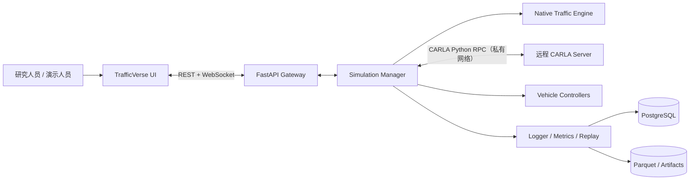
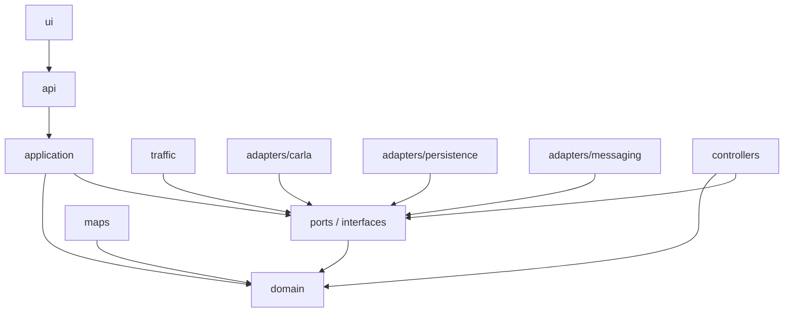
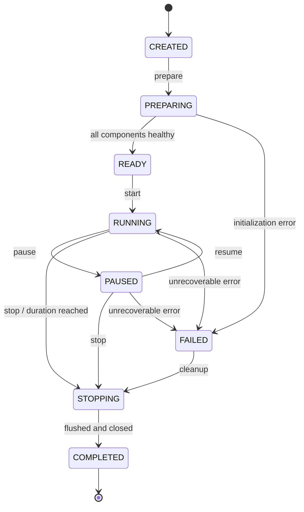
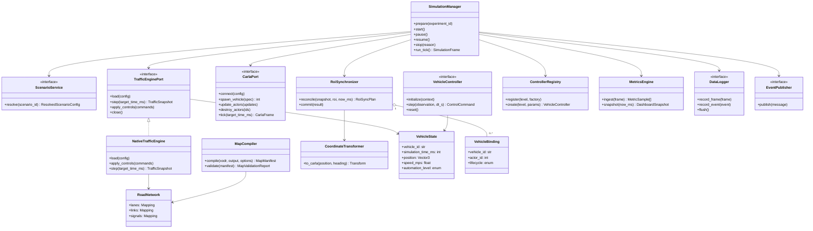
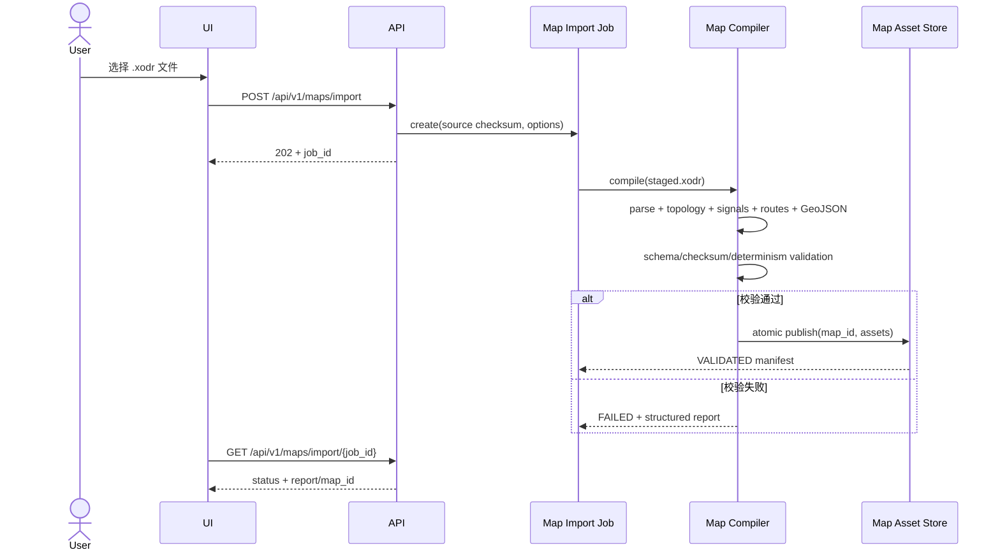
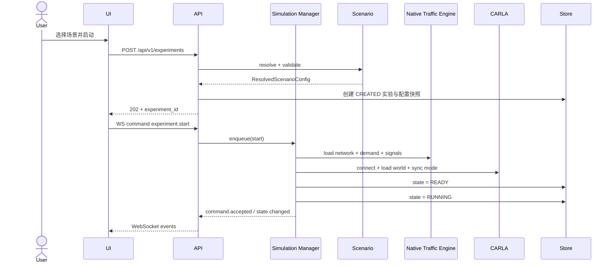
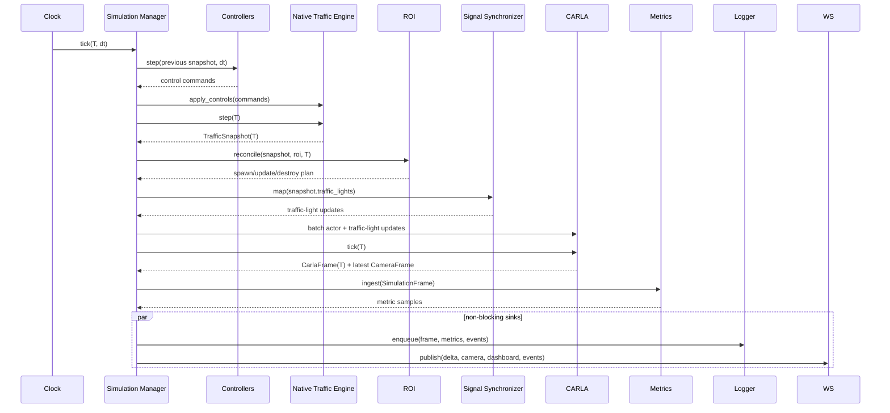
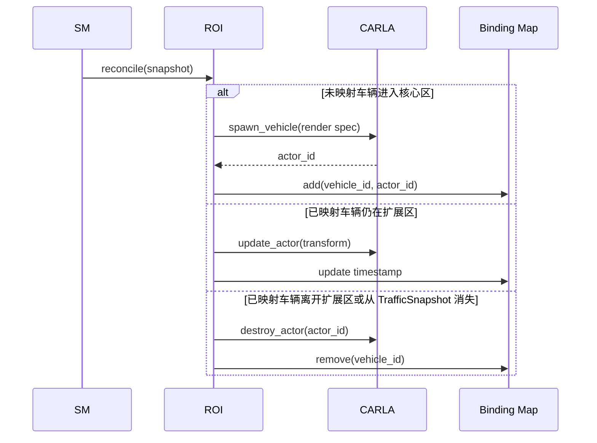
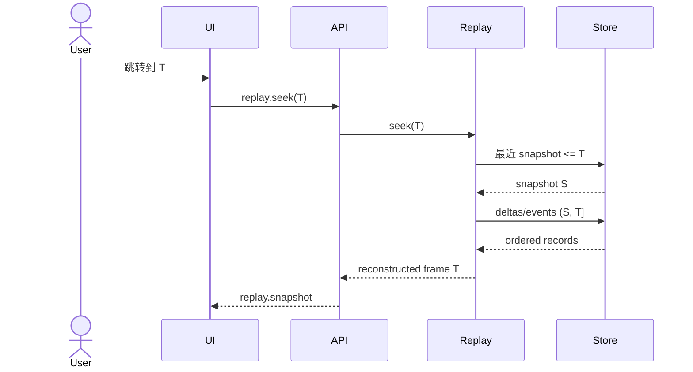
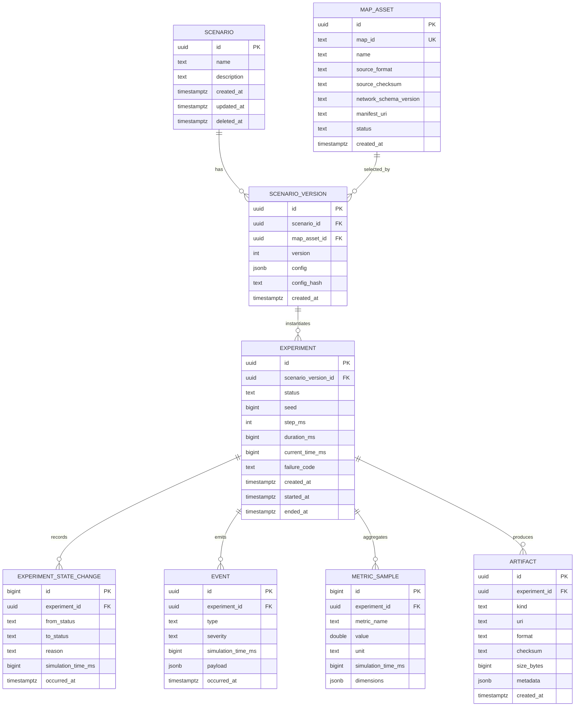

# TrafficVerse System Design

> 版本：v1.2
> 状态：Baseline  
> 输入：[PRD.md](./PRD.md)  
> 相关文档：[AGENT_DEVELOPMENT_GUIDE.md](./AGENT_DEVELOPMENT_GUIDE.md)、[ADR.md](./ADR.md)、[AGENTS.md](../AGENTS.md)

## 1. 文档目的

本文将 PRD 中的产品定义转化为可实现、可测试、可由多个 Agent 分工开发的系统设计。本文是实现层面的基线：若实现与本文冲突，应先更新 ADR，再修改本文和代码。

### 1.1 系统边界

TrafficVerse 是面向科研与演示的混合交通数字孪生平台，负责：

- 使用自研 Native Traffic Engine 计算全路网交通流；
- 在可配置的 ROI（Region of Interest）内将车辆镜像到 CARLA；
- 运行 Human、ACC、L2、L3、L4 等统一接口的车辆控制器；
- 提供二维态势、三维局部画面、实时指标、事件与实验控制；
- 持久化实验配置、事件、指标和轨迹，并支持确定性回放。

不在 v1.1 MVP 范围内：多格式地图导入、完整成熟交通模型、真实车辆闭环控制、完整传感器数据集生成、分布式多机仿真、生产级多租户与云端弹性调度。

### 1.2 不可变架构原则

1. **Native Traffic Engine 是运动学真值源**：全局车辆的存在、位置、速度、车道、路线和信号灯状态由本项目自研引擎生成。
2. **CARLA 是 ROI 内的高保真表现层**：CARLA Actor 是 `VehicleState` 的镜像，不独立决定全局交通状态。
3. **单一仿真时钟**：Simulation Manager 以固定步长推进控制器、Native Traffic Engine、ROI、CARLA、指标和发布流程。
4. **核心区加缓冲区**：车辆进入核心 ROI 时创建 Actor，离开扩展 ROI 时销毁 Actor，避免边界抖动。
5. **契约优先**：跨模块只传输 `VehicleState` 等公共模型或调用公开端口，不读取其他模块内部对象。
6. **配置外置**：可调参数来自 YAML，并在启动前完成类型、范围和交叉字段校验。
7. **异步事件走 WebSocket**：实时状态、指标、事件和异步控制结果使用版本化 WebSocket 消息；资源 CRUD 使用 REST。
8. **高频与关系数据分层存储**：实验元数据进入 PostgreSQL，高频轨迹进入 Parquet，原始配置和导出清单使用 JSON/YAML。

### 1.3 核心运行范围与延期范围

为避免 Agent 在第一轮实现中同时追求成熟交通模型和性能优化，v1.1 采用两个完成门槛。

**Core Run Gate（必须先完成）**只包含：

- 将固定 Town04 OpenDRIVE 编译为原生 `network.json` 和 `network.geojson`；
- Native Traffic Engine 作为唯一真值，以 50 ms 固定步长持续推进；
- Leaflet 显示全局原生路网、交通信号灯和车辆；
- 车辆进入/离开固定 ROI 时在 CARLA 创建、更新、销毁镜像 Actor；
- 原生信号灯状态同步到 CARLA；
- PySide6 显示 CARLA RGB 相机画面；
- 支持开始、暂停、恢复、停止和组件健康状态；
- 使用一个固定 seed 的基准场景完成端到端验收。

以下能力不阻塞 Core Run Gate，保留在后续 Product Gate：

- 精细 L2/L3/L4 行为、成熟驾驶人模型、无信号复杂路口与风险接管策略；
- 回放、视频录制、高级 Dashboard 和完整科研指标；
- 多 ROI、动态 ROI、多实验并发、行人和完整传感器套件；
- 5,000–10,000 车辆扩展优化、WebRTC/二进制视频、MapLibre 迁移；
- React、云部署、数字孪生数据接入和安全多租户。

延期表示不作为第一轮构建门槛，不表示删除相应模块或接口。

## 2. 总体架构

### 2.1 系统上下文



CARLA 画面在第一阶段固定采用 RGB 相机帧流呈现，不嵌入 CARLA 原生窗口。前端不直接控制 Native Traffic Engine 或 CARLA，所有控制命令都经由 API 和 Simulation Manager。原生 CARLA spectator 仅用于开发诊断，不属于产品界面。

### 2.2 运行时容器

| 容器 | 主要职责 | 进程边界 | 关键依赖 |
|---|---|---|---|
| UI | 场景配置、2D 地图、3D 视图、Dashboard、Replay | PySide6 进程；第二阶段可替换 React | HTTP/WebSocket client、Leaflet、Plotly |
| API Gateway | REST 资源接口、WebSocket 会话、鉴权预留、模型序列化 | FastAPI/uvicorn 进程 | Pydantic、Application Service |
| Simulation Runtime | 时钟、生命周期、命令串行化、步进编排 | 远程 Linux Python worker | Native Traffic Engine、CARLA client、Controller、ROI |
| Native Traffic Engine | 路网、路线、车辆、交通行为和信号灯 | Runtime 内部模块 | Python 标准库、Pydantic |
| Map Compiler | OpenDRIVE 导入、原生路网编译和 GeoJSON 生成 | 离线 CLI/内部模块 | XML parser、几何算法 |
| CARLA | ROI 三维场景、Actor、天气、相机 | 外部 server 进程 | CARLA Python API |
| Persistence | 元数据、事件、指标、轨迹、导出 | PostgreSQL + 文件系统/对象存储 | SQLAlchemy/Alembic、PyArrow |

MVP 采用模块化单体代码库。带三维的实验由远程 Linux Simulation Runtime 执行，CARLA Server
与 Runtime 位于同一 GPU 主机或低延迟私有网络；macOS UI 通过 REST/WebSocket 访问远程 API。
CARLA SDK 对象不跨进程或网络传输。后续如需多实验并发，可将每个 Simulation Runtime 提升为
独立 worker，不改变领域协议。

### 2.3 依赖方向



`domain` 不依赖 FastAPI、CARLA、SQLAlchemy 或 UI 框架。Native Traffic Engine 只依赖 `domain` 和公开 Port；第三方 SDK 只能出现在 adapter 层。

### 2.4 可运行环境基线

Core Run Gate 固定以下构建基线，Agent 不得自行升级单个组件：

| 项目 | 基线 |
|---|---|
| CARLA Server 主机 | Ubuntu 22.04 x86_64；Windows 11 可作为备选，不作为首个验收环境 |
| GPU | NVIDIA RTX 2070 或更高，至少 8 GB VRAM |
| Python | CPython 3.10.x |
| CARLA | Server 与 Python API 均为 0.9.16，版本必须完全一致 |
| Native Traffic Engine asset schema | `traffic-network/1.0` |
| PostgreSQL | 16.x |
| 仿真步长 | 50 ms |
| UI | PySide6 6.x；具体 patch 版本由 lockfile 固定 |

官方 CARLA 0.9.16 client/server 运行边界固定为 Ubuntu/Windows x86_64。带 CARLA 的首个
Core Run 要求 CARLA Server 与 Simulation Runtime 运行在远程 Ubuntu 22.04 GPU 主机；
macOS 运行 UI、开发工具和无 CARLA 测试，通过远程 TrafficVerse API 获取二维状态和 JPEG
相机帧，不直接依赖 CARLA Python SDK。参考 ADR-023。

运行时必须执行版本握手：

1. Native Traffic Engine 代码支持 manifest 中的 `network_schema_version`；
2. CARLA client/server version 完全一致；
3. Town04 asset manifest 的源 OpenDRIVE、编译器版本和 CARLA 版本一致；
4. 任一不一致时 `/ready` 返回 `VERSION_MISMATCH`，实验不得进入 `READY`。

依赖版本写入 `configs/runtime-baseline.yaml`，Python 依赖写入 lockfile；开发机不得依赖未锁定的 nightly build。

### 2.5 Core Run 启停约定

首轮只支持单机、单实验、单 UI 客户端。实现必须提供以下稳定入口：

```text
python -m trafficverse.cli doctor --profile core-run
python -m trafficverse.cli map compile configs/maps/town04/Town04.xodr --output configs/maps/town04
python -m trafficverse.cli map validate configs/maps/town04/manifest.yaml
python -m trafficverse.cli traffic smoke --scenario configs/scenarios/core-run-town04.yaml
python -m trafficverse.cli serve --host 127.0.0.1 --port 8000
python -m trafficverse.cli ui --api http://127.0.0.1:8000
```

启动顺序：

1. 在远程 Ubuntu GPU 主机启动 CARLA 0.9.16 server，RPC 2000/2001 只向远程 Runtime 所在私有网络开放；
2. `doctor` 检查 Python、原生路网 schema、CARLA client/server（启用时）、端口和磁盘；
3. 首次或源文件变化时运行 `map compile`；`map validate` 校验 Town04 checksum、拓扑、配准控制点、route 和 signal binding；
4. 在远程主机启动 API/Simulation Runtime；`/ready` 只有在依赖和资产全部通过后返回 200；
5. macOS 启动 PySide6 UI 并连接远程 API，选择固定 `core-run-town04.yaml`；
6. UI 发送 start 后，由 Simulation Manager 装载 Native Traffic Engine，并成为交通引擎 `step` 和 CARLA `world.tick()` 的唯一调用者。

停止顺序：停止接收命令 → 完成当前 tick → 停止相机 callback → 销毁相机和车辆 Actor → 关闭 Native Traffic Engine → 恢复 CARLA world settings → 发布最终状态。任何阶段重复 stop 都必须安全。

## 3. 核心领域模型与约定

### 3.1 标识、时间和单位

| 字段 | 约定 |
|---|---|
| `experiment_id` / `scenario_id` / `event_id` | UUID v4 字符串 |
| `vehicle_id` | 引擎生成或场景指定的稳定字符串 ID，在单次实验内唯一 |
| `carla_actor_id` | CARLA 整数 Actor ID，仅作为内部映射，不暴露为车辆主键 |
| `simulation_time_ms` | 从实验开始计的整数毫秒，是排序和回放的权威时间 |
| `sequence` | 每个实验单调递增的 64 位整数，用于检测丢包与重放 |
| 距离/位置 | 米（m） |
| 速度 | 米每秒（m/s）；UI 可转换为 km/h |
| 加速度 | 米每二次方秒（m/s²） |
| 角度 | 弧度；`heading_rad` 以地图坐标系正 x 轴逆时针为正 |

墙上时间仅用于审计，字段采用 UTC ISO 8601（例如 `2026-07-15T08:00:00Z`），不得驱动仿真。

### 3.2 公共数据契约

```python
class Vector3(BaseModel):
    x: float
    y: float
    z: float = 0.0

class VehicleState(BaseModel):
    schema_version: Literal["1.0"] = "1.0"
    experiment_id: UUID
    vehicle_id: str
    simulation_time_ms: int
    sequence: int
    automation_level: Literal["HUMAN", "ACC", "L2", "L3", "L4"]
    position: Vector3
    speed_mps: float
    acceleration_mps2: float
    heading_rad: float
    lane_id: str
    target_lane_id: str | None = None
    controller_id: str
    action: Literal[
        "KEEP_LANE", "ACCELERATE", "BRAKE", "LANE_CHANGE_LEFT",
        "LANE_CHANGE_RIGHT", "STOP", "TAKEOVER"
    ]
    risk_score: float = Field(ge=0.0, le=1.0)
    route_id: str | None = None

class TrafficLightState(BaseModel):
    signal_id: str
    simulation_time_ms: int
    phase: str
    remaining_ms: int | None

class SignalBinding(BaseModel):
    traffic_signal_id: str
    controlled_lane_link_ids: list[str]
    carla_opendrive_ids: list[str]
    state_map: dict[str, Literal["RED", "YELLOW", "GREEN", "OFF"]]

class CameraFrame(BaseModel):
    camera_id: str
    carla_frame: int
    simulation_time_ms: int
    width: int
    height: int
    encoding: Literal["jpeg"] = "jpeg"
    data_base64: str

class ControlCommand(BaseModel):
    desired_acceleration_mps2: float | None
    desired_speed_mps: float | None
    lane_change: Literal["NONE", "LEFT", "RIGHT"] = "NONE"
    stop_requested: bool = False
    takeover_requested: bool = False

class TrafficSnapshot(BaseModel):
    experiment_id: UUID
    simulation_time_ms: int
    sequence: int
    vehicles: tuple[VehicleState, ...]
    traffic_lights: tuple[TrafficLightState, ...]

class SimulationFrame(BaseModel):
    traffic: TrafficSnapshot
    carla: CarlaFrame | None = None
    events: tuple[DomainEvent, ...] = ()
    metrics: tuple[MetricSample, ...] = ()
```

所有公共模型必须：

- 可序列化为 JSON；
- 拒绝未知枚举值和非法范围；
- 提供 JSON Schema；
- 通过兼容性测试；
- 新增可选字段时保持向后兼容，删除/改名字段时提升主版本。

### 3.3 坐标转换

Native Traffic Engine 使用 OpenDRIVE 派生的局部平面坐标作为内部权威坐标。`CoordinateTransformer` 在启动时根据地图配准配置构建 traffic → CARLA 刚体变换：

```text
p_carla = Rz(yaw_offset) × S(axis_mapping) × p_traffic + translation
heading_carla = normalize(sign × heading_traffic + yaw_offset)
```

配准参数保存在场景 YAML 中。启动时至少使用三个非共线控制点进行误差校验；最大平面误差超过 `map.max_registration_error_m` 时拒绝启动。不得在 ROI Synchronizer 内散落坐标修正常量。

### 3.4 Town04 地图资产基线

Core Run Gate 只支持一个受控地图组合：CARLA 0.9.16 `Town04` 与由本项目 Map Compiler 从同一 `Town04.xodr` 生成的原生路网。不得从不同 CARLA 版本拼接 `.xodr`、`network.json` 和 traffic-light metadata。

资产生成流程：

1. 从 CARLA 0.9.16 Town04 取得 `Town04.xodr`；
2. Map Compiler 解析 road、planView、laneSection、lane width、speed、junction、connection、signal 和 validity；
3. 以固定采样间隔将参考线与车道中心线离散化，生成稳定 road/lane/lane-link ID；
4. 生成 `network.json`，包含车道几何、拓扑、停止线、路口连接和信号控制关系；
5. 生成 `routes.yaml`，固定 MVP 车辆、发车时间、起终点或显式 lane route；
6. 生成 `registration.yaml`，保存轴映射、heading 变换和至少三个控制点；
7. 生成 `signals.yaml` 和 `network.geojson`；
8. 计算所有文件 SHA-256，写入 `manifest.yaml`；
9. 执行 schema、拓扑、路线、信号引用和确定性校验后，资产才可标记为 `validated: true`。

Core Run 的 `routes.yaml` 必须固定包含 50 辆、稳定 vehicle ID 和确定性 depart time；其中至少 10 辆的路线穿过 ROI enter/exit 边界，至少 1 辆经过 `signals.yaml` 指定的验收路口。场景文件中的 `traffic.vehicles` 必须与 route 中实际车辆数一致，否则启动失败。

目录必须为：

```text
configs/maps/town04/
├── manifest.yaml
├── Town04.xodr
├── network.json
├── routes.yaml
├── registration.yaml
├── signals.yaml
└── network.geojson
```

`network.geojson` 使用原生引擎平面坐标，供 Leaflet `CRS.Simple` 使用。GeoJSON feature 至少包含 `road_id`、`lane_id`、`speed_limit_mps` 和 polyline。前端不得从 CARLA 截图或运行时私有对象推导二维路网。

`manifest.yaml` 至少包含：

```yaml
schema_version: "1.0"
map_id: town04-carla-0.9.16-native-v1
carla_map: Town04
carla_version: 0.9.16
network_schema_version: traffic-network/1.0
compiler_version: trafficverse-map/0.1
validated: true
max_registration_error_m: 0.50
strict_signal_mapping: true
files:
  Town04.xodr: "sha256:..."
  network.json: "sha256:..."
  registration.yaml: "sha256:..."
  signals.yaml: "sha256:..."
```

MVP Map Compiler 只承诺支持 Town04 实际使用的 OpenDRIVE 子集。任何未识别但影响车道连通性、路口或信号控制的元素都必须使编译失败；不得通过猜测生成可运行但语义不确定的资产。新增地图前必须先加入 importer fixture 和拓扑验收。

## 4. 模块详细设计

### 4.1 Scenario Manager

职责：场景创建、复制、校验、版本化、加载、删除和运行前解析。

公开接口：

```python
class ScenarioService(Protocol):
    async def create(self, draft: ScenarioDraft) -> Scenario: ...
    async def get(self, scenario_id: UUID) -> Scenario: ...
    async def list(self, query: ScenarioQuery) -> Page[ScenarioSummary]: ...
    async def update(self, scenario_id: UUID, draft: ScenarioDraft, version: int) -> Scenario: ...
    async def clone(self, scenario_id: UUID, name: str) -> Scenario: ...
    async def delete(self, scenario_id: UUID) -> None: ...
    async def resolve(self, scenario_id: UUID) -> ResolvedScenarioConfig: ...
```

校验分三层：YAML 语法、Pydantic 字段校验、跨字段/环境校验。例如自动驾驶比例之和必须为 1；`roi.buffer_m > 0`；步长必须被 Native Traffic Engine/CARLA 支持；地图配准文件必须存在。

### 4.2 Native Traffic Engine

职责：装载原生路网与需求、固定步进、车辆索引、路线执行、交通行为、安全约束、交通信号灯和不可变快照。

```python
class TrafficEnginePort(Protocol):
    def load(self, config: TrafficEngineConfig) -> None: ...
    def step(self, target_time_ms: int) -> TrafficSnapshot: ...
    def apply_controls(self, commands: Mapping[str, ControlCommand]) -> None: ...
    def close(self) -> None: ...
    def health(self) -> ComponentHealth: ...
```

约束：只有 Simulation Manager 可调用 `step`；每个 tick 返回不可变快照；引擎不得读取 UI/CARLA 状态决定交通真值；同一 tick 不允许边计算边原地修改其他车辆可见状态。

#### 4.2.1 原生路网模型

```python
@dataclass(frozen=True, slots=True)
class Lane:
    lane_id: str
    road_id: str
    centerline: tuple[Vector3, ...]
    cumulative_s_m: tuple[float, ...]
    length_m: float
    width_m: float
    speed_limit_mps: float
    predecessor_ids: tuple[str, ...]
    successor_ids: tuple[str, ...]
    left_lane_id: str | None
    right_lane_id: str | None

@dataclass(frozen=True, slots=True)
class LaneLink:
    link_id: str
    from_lane_id: str
    to_lane_id: str
    via_junction_id: str | None
    signal_id: str | None
    stop_line_s_m: float | None

@dataclass(frozen=True, slots=True)
class RoadNetwork:
    lanes: Mapping[str, Lane]
    links: Mapping[str, LaneLink]
    signals: Mapping[str, TrafficSignalDefinition]
```

`network.json` 是运行时唯一输入，OpenDRIVE 只由离线 Map Compiler 读取。运行时加载时必须校验 schema、checksum、引用完整性和路线可达性。

#### 4.2.2 车辆状态与空间索引

引擎内部状态至少包含 `lane_id`、`s_m`、`lateral_offset_m`、`speed_mps`、`acceleration_mps2`、`route_lane_ids`、`route_index`、`target_lane_id`。对外 `position` 和 `heading_rad` 由 lane polyline 按 `s_m` 插值得到。

每个 tick 开始时按 `(lane_id, s_m, vehicle_id)` 建立稳定有序索引，用于查找前车、后车和目标车道邻车。禁止对每辆车扫描全部车辆。MVP 可使用每车道排序数组；性能不够时再替换为空间树，不改变 Port。

#### 4.2.3 两阶段批量步进

```text
Phase A: 冻结 T-1 快照并构建车道索引
Phase B: 推进信号灯，生成本 tick 通行约束
Phase C: 对每辆车独立计算 ControllerIntent
Phase D: 合并路线、前车、信号和换道约束，生成 ProposedVehicleState
Phase E: 全局冲突/碰撞检查
Phase F: 按 vehicle_id 稳定顺序原子提交 T 快照
```

逻辑并行的含义是所有车辆读取同一 T-1 状态，计算结果与迭代顺序无关。MVP 不强制使用线程；只有 50 车性能门槛不达标且 profiling 指向行为计算时，才允许引入进程池或原生扩展。

#### 4.2.4 MVP 交通行为

- 自由行驶：以配置的最大加速度趋近期望速度和车道限速；
- 跟驰：根据净间距、相对速度、最小间距和期望时间间隔得到安全加速度；
- 信号停车：红/黄灯时将停止线视为静止障碍物，无法安全停车的黄灯可按配置继续；
- 路线：到达 lane 末端时只能进入当前 route 的合法 successor；
- 换道：只支持相邻同向车道，必须同时满足路线需要、目标车道存在、前后安全间距和冷却时间；
- 无信号路口：MVP 仅允许资产明确标记的优先方向；复杂 gap acceptance 延期；
- 到达/生成：生成位置被占用时延迟发车，到达最后 lane 后产生 arrival event 并删除。

控制命令只表达意图。最终加速度取控制意图、限速、跟驰、信号停车和安全边界的最保守可行结果；非法换道被拒绝并产生 `CONTROL_REJECTED`，不终止其他车辆。

#### 4.2.5 固定周期信号灯

`signals.yaml` 为每个 signal group 定义 phases：

```yaml
signals:
  - signal_id: junction_01
    offset_ms: 0
    phases:
      - duration_ms: 30000
        states: {north_south: GREEN, east_west: RED}
      - duration_ms: 3000
        states: {north_south: YELLOW, east_west: RED}
      - duration_ms: 30000
        states: {north_south: RED, east_west: GREEN}
      - duration_ms: 3000
        states: {north_south: RED, east_west: YELLOW}
```

phase duration 必须是 `step_ms` 的整数倍。MVP 不实现感应信号、自适应配时或运行中编辑 phase program。

#### 4.2.6 Map Compiler

Map Compiler 位于 `src/trafficverse/maps/`，提供：

```python
class MapCompiler:
    def compile(self, source_xodr: Path, output_dir: Path, options: ImportOptions) -> MapManifest: ...
    def validate(self, manifest_path: Path) -> MapValidationReport: ...
```

OpenDRIVE 几何按固定 `sample_interval_m` 离散化；stable ID 由 source road/lane/junction ID 组成，不使用遍历序号。编译必须可重复：相同输入、选项和编译器版本生成字节稳定的 JSON/YAML/GeoJSON 和相同 checksum。

### 4.3 CARLA Manager

职责：连接 server、加载 Town、设置同步模式和固定步长、天气、Actor 生命周期、变换批量更新、相机模式。

部署边界遵循 ADR-023：CarlaAdapter 使用官方 SDK 运行在远程 Linux Simulation Runtime 内，
`CarlaConfig.host/port/timeout_s` 描述远程 Runtime 到 CARLA Server 的受控 RPC 端点。macOS UI
不得直接创建 CARLA client。连接必须设置有限网络超时并校验 client/server 版本；断线时 Adapter
更新健康状态并允许上层切换到二维降级。RPC 端点不承载用户鉴权，不得暴露到公网。

```python
class CarlaPort(Protocol):
    def connect(self, config: CarlaConfig) -> None: ...
    def load_world(self, map_name: str, weather: WeatherConfig) -> None: ...
    def spawn_vehicle(self, spec: RenderVehicleSpec) -> int: ...
    def update_actors(self, updates: Sequence[ActorTransform]) -> None: ...
    def destroy_actors(self, actor_ids: Sequence[int]) -> None: ...
    def update_traffic_lights(self, updates: Sequence[TrafficLightUpdate]) -> None: ...
    def tick(self, target_time_ms: int) -> CarlaFrame: ...
    def set_camera(self, command: CameraCommand) -> None: ...
    def latest_camera_frame(self) -> CameraFrame | None: ...
    def close(self) -> None: ...
```

Actor 生成失败时进入有限次数重试队列；不得阻塞 Native Traffic Engine 真值推进。CARLA 中镜像车辆关闭自主驾驶和碰撞驱动，位置由同步器写入；视觉碰撞可记录为事件，但不反写为全局真值。

CARLA 同步模式由 Simulation Manager 独占 tick 权。其他 client 只能读取状态，禁止调用 `world.tick()`。世界必须在设置同步模式与 `fixed_delta_seconds=0.05` 后重新加载，再生成 Actor 和相机。Actor 与信号灯更新使用 batch API；相机回调只写入有界队列，不推进世界。

### 4.3.1 Traffic Light Synchronizer

职责：将 `TrafficSnapshot.traffic_lights` 按 `signals.yaml` 转为 CARLA traffic-light state。Native Traffic Engine 始终是信号灯相位主控。

规则：

- 启动时解析全部 `SignalBinding`，验证原生 signal、controlled lane link 和 CARLA OpenDRIVE signal ID 均存在；再通过 `TrafficLight.get_opendrive_id()` 解析本次 world 的运行时 Actor ID；
- world 加载后对所有 mapped CARLA traffic light 调用 `freeze(True)` 并验证冻结成功；
- `strict_signal_mapping: true` 时，任何缺失、重复或无法映射的 binding 都使实验无法进入 `READY`；
- 每个 tick 在 CARLA `world.tick()` 前批量写入 RED/YELLOW/GREEN/OFF；
- CARLA 侧自动周期被禁用，不允许 CARLA 自主推进灯色；
- 原生 lane-link state 如无法一一映射，必须在 Map Compiler 阶段显式合并，运行时不得猜测；
- Core Run 验收场景必须经过至少一个信号控制路口，并逐 tick 比较两侧灯色。

CARLA Actor ID 只在单次 world 生命周期内有效，禁止写入 `signals.yaml`。持久化 binding 只使用 OpenDRIVE signal ID；world reload 后必须重新解析运行时 Actor。

Core Run 只接受 `RED`、`YELLOW`、`GREEN`、`OFF`。一个 binding 中的多个 lane link 必须在验收场景的每个 phase 归一化为同一颜色；出现未知状态或同一 binding 内颜色冲突时，地图资产校验失败，而不是在运行时选择任意颜色。

### 4.4 ROI Synchronizer

职责：选择需镜像的车辆、维护 `vehicle_id ↔ actor_id` 映射、创建/更新/销毁 Actor、处理边界滞回和失败重试。

ROI 由一个或多个焦点与半径定义。默认 `radius_m = 1000`，缓冲区 `buffer_m = 200`：

- 未映射车辆进入距离 `<= radius_m`：创建；
- 已映射车辆仅在距离 `> radius_m + buffer_m`：销毁；
- 中间区域保持上一个映射状态。

```python
@dataclass
class VehicleBinding:
    vehicle_id: str
    actor_id: int
    created_at_ms: int
    last_updated_at_ms: int
    lifecycle: Literal["SPAWNING", "ACTIVE", "DESTROY_PENDING"]

class RoiSynchronizer:
    def reconcile(
        self,
        snapshot: TrafficSnapshot,
        roi: RoiDefinition,
        now_ms: int,
    ) -> RoiSyncPlan: ...

    def commit(self, result: RoiApplyResult) -> None: ...
```

`reconcile` 是纯逻辑，可在无 Native Traffic Engine/CARLA 环境下测试；副作用由 `RoiApplyService` 执行。车辆从交通快照消失时，无论其与 ROI 的距离如何，都必须清理对应 Actor。

### 4.5 Vehicle Controller

职责：根据当前车辆、邻车、道路和事件上下文输出控制意图。控制器不得直接修改引擎状态或调用 CARLA。

```python
class VehicleController(Protocol):
    @property
    def controller_id(self) -> str: ...
    def initialize(self, context: ControllerInitContext) -> None: ...
    def step(self, observation: VehicleObservation, dt_s: float) -> ControlCommand: ...
    def reset(self) -> None: ...

class ControllerRegistry:
    def register(self, level: AutomationLevel, factory: ControllerFactory) -> None: ...
    def create(self, level: AutomationLevel, params: Mapping[str, Any]) -> VehicleController: ...
```

控制命令在下一次 Native Traffic Engine 步进前统一应用。MVP 控制器是确定性的；随机行为必须使用实验 seed 派生的独立随机流。

### 4.6 Visualization

职责：将标准快照转为 2D 地图图层、车辆标签、HUD、轨迹和风险覆盖层；管理相机命令但不直接操作 CARLA SDK。

前端采用增量帧：低频 `world.snapshot` 提供全量状态，高频 `vehicle.delta` 提供变化。客户端发现 sequence 缺口后请求新快照，不自行猜测缺失状态。

二维 Core Run 固定使用 Leaflet `CRS.Simple`：首次加载通过 REST 获取 `network.geojson`，随后只通过 WebSocket 更新车辆位置和信号状态。车辆坐标直接使用 Native Traffic Engine 平面坐标；UI 只执行视图缩放和 y 轴显示适配，不进行地图配准。

三维 Core Run 固定使用 CARLA `sensor.camera.rgb`：

- 默认分辨率 `960×540`、10 FPS、JPEG quality 75；
- 默认相机模式 `BIRD_VIEW`，也支持 `FOLLOW`；FREE/ROAD_SIDE/DRONE 不阻塞 Core Run；
- CARLA sensor callback 按 `carla_frame` 缓存，队列容量为 2，过期帧直接丢弃；
- Simulation Manager 是唯一 tick client，并在 CARLA tick 后读取对应或最新已完成帧；
- `CameraFrame` 必须携带 `carla_frame` 和 `simulation_time_ms`，相机帧不作为运动学真值；
- MVP 通过 JSON `data_base64` 发送 JPEG，发送队列容量为 1，只保留最新帧；二进制/WebRTC 属于后续优化。

Core Run 不要求三维回放。实时三维正常显示即通过；结构化回放与录像在 Product Gate 验收。

### 4.7 Dashboard

职责：按固定窗口聚合平均速度、旅行时间、通行量、排队、事故、自动驾驶比例、换道、急刹、接管、FPS、CPU/GPU 等指标。

```python
class MetricsEngine:
    def ingest(self, frame: SimulationFrame) -> list[MetricSample]: ...
    def snapshot(self, now_ms: int) -> DashboardSnapshot: ...
```

每个指标必须定义名称、单位、聚合窗口、维度和空值语义。UI 不重新计算权威业务指标。

### 4.8 Replay

职责：加载实验清单、按仿真时间读取快照/事件、暂停、逐帧、变速和跳转。

回放不重新运行控制器。记录器每 `replay.snapshot_interval_ms` 写入可恢复快照，并在快照间记录 delta/event。跳转时读取目标时间之前最近快照，再顺序应用增量。

### 4.9 Data Logger

职责：写入实验状态、配置快照、结构化日志、事件、指标、轨迹和 artifact manifest；执行缓冲、批量写、滚动文件和完整性校验。

高频写入与仿真循环隔离。队列达到上限时：保留错误/事件/实验状态；轨迹允许按配置降采样，但必须发出 `DATA_DEGRADED` 事件，不得静默丢失。

### 4.10 Simulation Manager

Simulation Manager 是应用编排器，不包含第三方 SDK 细节。

```python
class SimulationManager:
    async def prepare(self, experiment_id: UUID) -> None: ...
    async def start(self) -> None: ...
    async def pause(self) -> None: ...
    async def resume(self) -> None: ...
    async def stop(self, reason: StopReason) -> None: ...
    async def set_speed(self, multiplier: float) -> None: ...
    async def run_tick(self) -> SimulationFrame: ...
```

实验状态机：



所有外部命令进入每个实验的串行命令队列，避免同时 `pause`、`stop`、`seek` 造成竞态。状态变更必须幂等。

## 5. 类图



## 6. 关键时序

### 6.1 地图导入与发布



发布必须采用 staging → 校验 → 原子 rename，防止场景读取半生成资产。源文件 checksum 已存在时可返回已有地图，但必须校验编译器版本和 options hash 一致。

### 6.2 实验启动



### 6.3 单个固定步长



控制命令基于上一帧观察产生并作用于当前原生引擎步进，可消除同一 tick 内的隐式循环依赖。

硬性顺序为：应用控制意图 → Native Traffic Engine `step` → 原子提交同一 `TrafficSnapshot` → 生成 ROI/信号灯计划 → 一次 CARLA batch → CARLA `world.tick`。任何 UI、相机 callback 或日志 writer 都不得调用引擎 step 或 CARLA tick。相机 GPU 管线可能滞后，发布时使用其真实 `carla_frame`，不得把旧图像伪标成当前帧。

### 6.4 ROI 进入与离开



### 6.5 回放跳转



## 7. 数据库与文件结构

### 7.1 存储分工

- PostgreSQL：地图资产登记、场景、实验、状态变更、事件索引、聚合指标、artifact 元数据。
- Parquet：车辆高频轨迹、道路状态、回放 snapshot/delta；按实验和时间分区。
- YAML：用户可编辑的场景源文件。
- JSON：解析后的不可变配置快照、manifest、轻量导出。
- 日志：结构化 JSON Lines，可由部署环境收集。

### 7.2 ER 图



### 7.3 约束与索引

- `scenario_version (scenario_id, version)` 唯一；发布后的版本不可原地修改。
- `map_asset.map_id` 和 `source_checksum` 唯一；状态为 `VALIDATED` 才能被新场景引用。
- `experiment.status` 使用受控枚举：`CREATED/PREPARING/READY/RUNNING/PAUSED/STOPPING/COMPLETED/FAILED`。
- `event (experiment_id, simulation_time_ms)`、`metric_sample (experiment_id, metric_name, simulation_time_ms)` 建立 B-tree 索引。
- `metric_sample.dimensions` 如需按维度查询，建立 GIN 索引；MVP 不为未使用字段预建索引。
- 所有删除场景默认软删除；实验及科研产物不得级联物理删除。
- schema 通过 Alembic 迁移，应用启动时不得自动生成生产表。

用户导入的地图资产写入 `artifacts/maps/{map_id}/`，内置验收地图保存在 `configs/maps/town04/`。上传源文件先进入同一根目录下的 staging 子目录；校验或编译失败时保留结构化报告但不得发布为可选地图。任何上传文件名都不得直接参与最终路径拼接。

### 7.4 Parquet 布局

```text
artifacts/
└── experiments/{experiment_id}/
    ├── manifest.json
    ├── resolved_scenario.yaml
    ├── trajectories/
    │   └── minute={000000..}/part-*.parquet
    ├── road_states/
    │   └── minute={000000..}/part-*.parquet
    ├── replay/
    │   ├── snapshots/part-*.parquet
    │   └── deltas/part-*.parquet
    ├── exports/
    └── logs/runtime.jsonl
```

轨迹主键语义为 `(experiment_id, simulation_time_ms, vehicle_id)`。每个文件写入后计算 SHA-256，并登记到 `artifact` 和 `manifest.json`。

## 8. 接口协议

### 8.1 REST API

基础路径 `/api/v1`，请求和响应使用 UTF-8 JSON；使用 OpenAPI 自动发布契约。

| 方法与路径 | 用途 | 成功响应 |
|---|---|---|
| `POST /maps/import` | 上传 OpenDRIVE 并创建异步编译任务 | `202 MapImportJob` |
| `GET /maps/import/{job_id}` | 查询编译/校验进度和错误 | `200 MapImportJob` |
| `GET /maps` | 查询可选择的已验证地图 | `200 MapSummary[]` |
| `POST /scenarios` | 创建场景 | `201 Scenario` |
| `GET /scenarios` | 分页查询场景 | `200 Page<ScenarioSummary>` |
| `GET /scenarios/{id}` | 获取场景及最新版本 | `200 Scenario` |
| `GET /maps/{map_id}/network` | 获取原生路网 GeoJSON | `200 application/geo+json` |
| `GET /maps/{map_id}/manifest` | 获取地图版本、校验和与配准状态 | `200 MapManifest` |
| `PUT /scenarios/{id}` | 基于版本更新场景 | `200 Scenario` |
| `POST /scenarios/{id}/clone` | 复制场景 | `201 Scenario` |
| `DELETE /scenarios/{id}` | 软删除场景 | `204` |
| `POST /scenarios/validate` | 仅校验草稿 | `200 ValidationResult` |
| `POST /experiments` | 从场景版本创建实验 | `202 Experiment` |
| `GET /experiments/{id}` | 获取实验状态 | `200 Experiment` |
| `GET /experiments/{id}/events` | 分页查询事件 | `200 Page<Event>` |
| `GET /experiments/{id}/metrics` | 查询指标序列 | `200 MetricSeries[]` |
| `GET /experiments/{id}/artifacts` | 获取产物清单 | `200 Artifact[]` |
| `GET /health` | API 存活探针 | `200` |
| `GET /ready` | DB/Native Traffic Engine/CARLA 依赖就绪状态 | `200/503` |

错误统一为：

```json
{
  "error": {
    "code": "SCENARIO_VALIDATION_FAILED",
    "message": "automation proportions must sum to 1.0",
    "details": [{"path": "automation", "reason": "sum=1.2"}],
    "trace_id": "01J..."
  }
}
```

写接口支持 `Idempotency-Key`；更新场景使用 `If-Match`/版本号进行乐观锁。状态冲突返回 `409`，字段校验失败返回 `422`。

Core Run 的 `POST /experiments` 请求包含 `scenario_id`，并可携带已由 `/maps` 返回的 `map_id`。
指定 `map_id` 时，Runtime 必须从同一个已验证发布目录装载 `network.json`、`routes.yaml`、
`signals.yaml`、`registration.yaml` 和 manifest；UI 选择地图不得只改变显示而不改变仿真输入。

### 8.2 WebSocket

连接：`GET /api/v1/ws?experiment_id={uuid}`。连接成功后服务端发送 `session.ready`。客户端通过 `subscribe` 指定 topic 和期望频率。

统一 envelope：

```json
{
  "schema_version": "1.0",
  "type": "vehicle.delta",
  "message_id": "01J...",
  "correlation_id": null,
  "experiment_id": "3d1c...",
  "simulation_time_ms": 12500,
  "sequence": 482,
  "sent_at": "2026-07-15T08:00:00.125Z",
  "payload": {}
}
```

客户端命令：

| `type` | 主要 payload | 合法状态 |
|---|---|---|
| `experiment.start` | `{}` | `READY` |
| `experiment.pause` | `{}` | `RUNNING` |
| `experiment.resume` | `{}` | `PAUSED` |
| `experiment.stop` | `{"reason":"USER_REQUEST"}` | `RUNNING/PAUSED` |
| `experiment.speed.set` | `{"multiplier":2.0}` | `RUNNING/PAUSED` |
| `vehicle.control` | `{"vehicle_id":"veh-1","desired_speed_mps":8.0,"lane_change":"NONE","stop_requested":false}` | `RUNNING/PAUSED` |
| `camera.set` | `{"mode":"FOLLOW","vehicle_id":"veh-1"}` | `RUNNING/PAUSED/REPLAY` |
| `replay.play` | `{"multiplier":1.0}` | Replay session |
| `replay.pause` | `{}` | Replay session |
| `replay.seek` | `{"simulation_time_ms":60000}` | Replay session |
| `subscribe` | `{"topics":["vehicles","camera","dashboard","events"],"max_hz":10}` | 任意 |

服务端消息：`command.accepted`、`command.rejected`、`experiment.state.changed`、`world.snapshot`、`vehicle.delta`、`traffic_light.delta`、`camera.frame`、`dashboard.snapshot`、`event.created`、`component.health`、`replay.snapshot`、`error`。

命令响应必须复制请求的 `message_id` 到 `correlation_id`。控制命令只表示进入队列；真正生效时发送状态或结果事件。

`camera.frame` 的 payload：

```json
{
  "camera_id": "main",
  "carla_frame": 381,
  "simulation_time_ms": 19050,
  "width": 960,
  "height": 540,
  "encoding": "jpeg",
  "data_base64": "/9j/4AAQSk..."
}
```

相机 topic 默认 10 Hz、单订阅者。超过单帧大小上限或客户端消费过慢时丢弃旧相机帧，不影响 `world.snapshot`、事件或仿真 tick。

### 8.3 流控与恢复

- 每个客户端有有界发送队列；事件和状态变更不可丢，车辆 delta 可合并为最新值。
- Dashboard 默认 2 Hz，2D 车辆默认 10 Hz，后端内部仿真可采用更高固定频率。
- 客户端发现 `sequence` 不连续或重连后，发送 `world.snapshot.request`。
- 心跳：服务端每 15 秒 ping，45 秒无响应断开。
- 单条消息超过部署上限时应分片或改用 REST artifact，不发送巨型 WebSocket 帧。

## 9. 场景配置

推荐基线：

```yaml
schema_version: "1.1"
scenario:
  name: town04-mixed-traffic
  map_id: town04-carla-0.9.16-native-v1
  seed: 42
simulation:
  step_ms: 50
  duration_ms: 600000
  speed_multiplier: 1.0
traffic:
  network: configs/maps/town04/network.json
  routes: configs/maps/town04/routes.yaml
  vehicles: 50
  behavior_profile: mvp-default
automation:
  proportions:
    HUMAN: 1.0
    L2: 0.0
    L3: 0.0
    L4: 0.0
roi:
  radius_m: 1000
  buffer_m: 200
  focus:
    mode: fixed
    x: 0.0
    y: 0.0
carla:
  mode: optional
  host: localhost
  port: 2000
  timeout_s: 10
  expected_version: 0.9.16
traffic_engine:
  network_schema_version: traffic-network/1.0
  collision_policy: reject_unsafe_transition
weather:
  preset: ClearNoon
map_registration:
  manifest: configs/maps/town04/manifest.yaml
camera:
  mode: BIRD_VIEW
  width: 960
  height: 540
  fps: 10
  jpeg_quality: 75
logging:
  trajectory_hz: 10
  parquet_batch_rows: 10000
replay:
  snapshot_interval_ms: 5000
```

`host`、`port` 等部署值可由环境变量覆盖，但领域参数的最终解析结果必须写入实验配置快照。

上述 50 辆、全 HUMAN 的配置是 Core Run 基准，不是产品容量上限。完成 Core Run 后再启用混合自动驾驶比例和 2,500 辆性能场景。

## 10. 目录结构

```text
trafficverse/
├── AGENTS.md
├── pyproject.toml
├── uv.lock
├── README.md
├── .env.example
├── configs/
│   ├── scenarios/
│   ├── maps/
│   │   └── town04/
│   │       ├── manifest.yaml
│   │       ├── Town04.xodr
│   │       ├── network.json
│   │       ├── routes.yaml
│   │       ├── registration.yaml
│   │       ├── signals.yaml
│   │       └── network.geojson
│   ├── runtime-baseline.yaml
│   └── defaults.yaml
├── contracts/
│   ├── scenario.schema.json
│   ├── openapi.yaml
│   └── websocket/
├── src/trafficverse/
│   ├── __init__.py
│   ├── bootstrap.py
│   ├── config/
│   ├── domain/
│   │   ├── models/
│   │   ├── enums.py
│   │   ├── errors.py
│   │   └── events.py
│   ├── ports/
│   │   ├── simulation.py
│   │   ├── persistence.py
│   │   └── messaging.py
│   ├── application/
│   │   ├── scenario_service.py
│   │   ├── simulation_manager.py
│   │   ├── metrics_engine.py
│   │   └── replay_service.py
│   ├── maps/
│   │   ├── opendrive_parser.py
│   │   ├── compiler.py
│   │   ├── geojson.py
│   │   └── validator.py
│   ├── traffic/
│   │   ├── engine.py
│   │   ├── network.py
│   │   ├── demand.py
│   │   ├── routing.py
│   │   ├── spatial_index.py
│   │   ├── behavior.py
│   │   ├── lane_change.py
│   │   ├── signals.py
│   │   └── safety.py
│   ├── adapters/
│   │   ├── carla/
│   │   ├── persistence/
│   │   └── messaging/
│   ├── roi/
│   │   ├── geometry.py
│   │   ├── synchronizer.py
│   │   ├── signal_synchronizer.py
│   │   └── coordinate_transformer.py
│   ├── controllers/
│   │   ├── base.py
│   │   ├── registry.py
│   │   ├── human.py
│   │   ├── acc.py
│   │   ├── l2.py
│   │   ├── l3.py
│   │   └── l4.py
│   ├── api/
│   │   ├── app.py
│   │   ├── dependencies.py
│   │   ├── rest/
│   │   └── websocket/
│   ├── logging/
│   └── cli.py
├── ui/
│   ├── app/
│   ├── api_client/
│   ├── models/
│   ├── views/
│   ├── viewmodels/
│   ├── widgets/
│   ├── web/
│   └── assets/
├── migrations/
├── tests/
│   ├── unit/
│   ├── contract/
│   ├── integration/
│   ├── e2e/
│   ├── performance/
│   └── fixtures/
├── scripts/
│   ├── maps/
│   ├── dev/
│   └── ci/
├── artifacts/                 # gitignored runtime output
└── docs/
    ├── PRD.md
    ├── SYSTEM_DESIGN.md
    ├── AGENT_DEVELOPMENT_GUIDE.md
    └── ADR.md
```

## 11. 非功能要求

### 11.1 性能基线

- Core Run 基准：Town04、50 辆 Native Traffic Engine 车辆、至少 10 个 CARLA Actor、连续 2 分钟；
- Product Gate 候选目标：2,500 辆原生引擎车辆；必须在 Core Run 后通过 profiling 再冻结，5,000–10,000 不属于 MVP；
- CARLA Actor 数由 ROI 和硬件预算限制，达到 `carla.max_actors` 时按距离/关注车辆优先级选择并发出降级事件；
- 默认固定步长 50 ms；在基线硬件上持续 10 分钟运行，仿真 tick 的 p95 不高于步长对应的实时预算（1× 模式）；
- 2D 状态端到端 p95 延迟目标 < 250 ms，Dashboard < 1 s；
- 连续运行期间内存不应呈无界增长。

具体硬件和可达阈值应在基准测试后写回本文；未测量前不得宣称达到扩展目标。

### 11.2 可靠性

- 启动任一关键依赖失败，实验进入 `FAILED` 并执行幂等清理；
- CARLA 暂时不可用时允许按配置继续原生二维仿真并标记三维降级；Native Traffic Engine 出现不可恢复状态错误时终止实验；
- 停止时依次停止接收新命令、结束 tick、刷新日志、销毁 Actor、关闭交通引擎、写入 manifest；
- 所有外部资源操作应支持重复清理。

### 11.3 可观测性

日志字段至少包含：`trace_id`、`experiment_id`、`component`、`simulation_time_ms`、`event`、`level`。核心指标包含 tick duration、real-time factor、车辆数、ROI Actor 数、WebSocket queue depth、logger queue depth、spawn failures 和 dropped/coalesced deltas。

### 11.4 安全与部署

MVP 默认只监听本机。若监听非 loopback 地址，必须启用鉴权、来源限制和 TLS；场景文件路径必须限制在配置根目录；API 不接受任意 shell 命令或任意文件 URI。

## 12. 测试策略

| 层级 | 范围 | 是否需要外部仿真器 |
|---|---|---|
| Unit | ROI 几何、状态机、配置、控制器、指标、坐标转换 | 否 |
| Contract | 公共模型 JSON Schema、Port fake、一致错误结构 | 否 |
| Integration | Map Compiler、Native Traffic Engine、CARLA adapter、PostgreSQL、Parquet | 对应测试环境 |
| Core E2E | 地图编译→启动→运行→ROI/TLS/Camera→暂停→停止 | Native Traffic Engine 必需；CARLA 可按环境分档 |
| Product E2E | 创建场景→运行→指标/记录→停止→回放 | Native Traffic Engine 必需；CARLA 可分带/不带两档 |
| Performance | 车辆规模、ROI Actor、tick p95、队列和内存 | 基线硬件 |

关键性质测试：ROI 滞回不抖动；映射一一对应；时间和 sequence 单调；同 seed 的控制器输出一致；停止后无残留 Actor；回放重建帧与原始记录哈希一致。

### 12.1 Core Run 固定验收场景

只使用 `configs/scenarios/core-run-town04.yaml`，禁止 Agent 临时生成不可复现路线替代验收资产。

| 场景阶段 | 输入 | 必须观测到的结果 |
|---|---|---|
| Bring-up | Town04、seed 42、50 HUMAN、50 ms | 原生引擎/地图均 READY；启用 CARLA 时版本 READY |
| Global 2D | 运行 200 tick | 2D 车辆数与 TrafficSnapshot 相等，sequence 无缺口 |
| ROI enter | 10 辆基准车驶入 1000 m 核心区 | 每车一个 Actor，坐标误差 ≤ 0.5 m |
| ROI hysteresis | 车辆位于 1000–1200 m | 已映射车辆保持，不重复 spawn/destroy |
| Signal | 基准车经过指定 Town04 信号路口 | CARLA 与 Native Traffic Engine 灯色逐 tick 一致 |
| Camera | BIRD_VIEW 订阅 10 秒 | UI 连续显示 JPEG，帧时间单调且队列有界 |
| ROI exit | 基准车驶出 1200 m | Actor 销毁，binding 清空 |
| Lifecycle | pause 2 秒后 resume，再 stop | pause 不推进仿真，stop 后无外部资源残留 |

验收输出保存为机器可读 JSON，包括版本、资产 hash、每阶段断言、失败原因和资源清理结果。截图可以辅助审查，但不能替代数值断言。

## 13. 完成判定

### 13.1 Core Run Gate

第一轮构建只在下列条件全部满足时完成：

1. Town04 可从 OpenDRIVE 确定性编译，manifest 全部 checksum 正确且 `validated: true`；
2. Native Traffic Engine 与 CARLA 都只有 Simulation Manager 推进，50 ms 步长连续单调；
3. 固定 seed 的 50 辆场景至少运行 2 分钟，Leaflet 显示全部原生引擎车辆和信号灯；
4. 至少 10 辆车进入并离开 ROI，每辆恰好创建一个 CARLA Actor，离开后无孤儿 Actor；
5. 基准车辆经过信号路口时，Native Traffic Engine 与 CARLA 灯色在同一仿真 tick 一致；
6. PySide6 连续显示带 `carla_frame`/`simulation_time_ms` 的 RGB 相机帧；
7. start、pause、resume、stop 可重复执行，停止后无残留引擎任务、CARLA Actor 或相机 sensor；
8. CARLA 断开时明确报告三维降级，原生引擎不可恢复错误使实验进入 `FAILED` 并清理资源。

Core Run 不以 PostgreSQL、回放、L2–L4、2,500 辆性能或高级 Dashboard 为阻塞条件。

### 13.2 Product Gate

完整产品设计落地还必须满足：

1. `VehicleState`、WebSocket envelope、场景 schema 和 Port 接口有可执行契约测试；
2. 模块只能沿第 2.3 节依赖方向导入；
3. 一个无 CARLA 的 Native Traffic Engine smoke 场景可完成全生命周期；
4. 一个小型 Native Traffic Engine + CARLA 场景可验证 ROI 创建、更新和销毁；
5. 实验结束后可从记录数据执行暂停、倍速和 seek 回放；
6. 三份基线文档中的术语、目录、任务编号和 ADR 决策保持一致。
